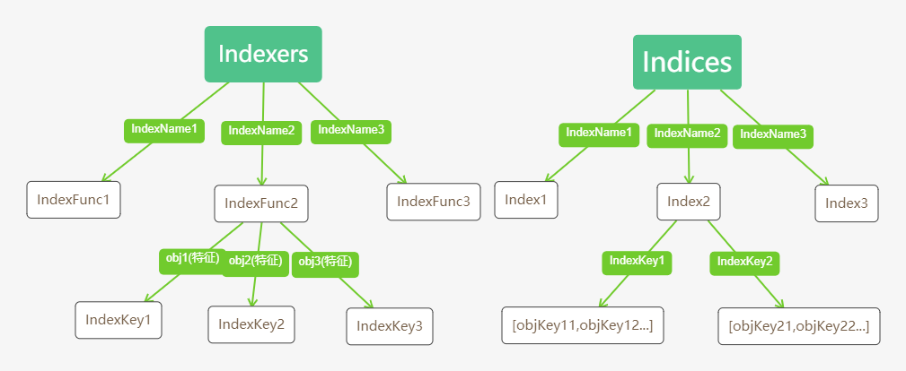

## Informer介绍

Kubernetes系统组件之间通过HTTP协议通信，在不依赖任何中间件的情况下如何保证消息的实时性、可靠性、顺序性呢？答案就是Informer机制，Kubernetes的其他组件都是通过client-go的Informer机制与Kubernetes API Server进行通信的。

### 架构设计

Informer运行原理图如下所示：


在架构设计中核心组件分别如下：

#### 1. Reflector

Reflector用于监控（Watch）指定的 Kubernetes 资源，当监控资源发生变化时，触发相应的变更事件，例如 Added 事件、

Updated 事件、Deleted 事件，并将其资源对象存放到本地缓存 DeltaFIFO 中。

#### 2. DeltaFIFO

DeltaFIFO 可以分开理解，FIFO 是一个先进先出队列，拥有 Add、Update、Delete、List、Pop、Close 等方法，而 Delta 是一个资源对象存储，它可以保存资源对象的操作类型，例如 Added 、Updated、Deleted、Sync 等操作类型。

#### 3. Indexer

Indexer 是 client-go 用来存储资源对象并自带索引功能的本地存储，Reflector 从 DeltaFIFO 中将消费出来的资源对象存储至 Indexer。Indexer 与 Etcd 集群中的数据完全保持一致。client-go 可以方便的从本地存储中读取资源数据，而无需每次远程通过 Kubernetes API Server从Etcd集群中读取。

## 源码分析

#### 1. 资源 Informer

每一个 Kubernetes 资源都实现了一个 Informer 机制。每一个 Informer 都会实现 Informer 和 Lister 方法，例如 PodInformer，代码如下：

```go
// 路径：vendor/k8s.io/client-go/informers/factory.go
type PodInformer interface {
	Informer() cache.SharedIndexInformer
	Lister() v1.PodLister
}
```

调用不同资源的 Informer，代码示例如下：

```go
podInformer := shareInformers.Core().V1().Pods().Informer()
NodeInformer := shareInformers.Node().V1beta1().RuntimeClasses().Informer()
```

#### 2. Shared Informer 共享机制

Informer 也被称为 Shared Informer，在使用 client-go 时，若同一资源的 Informer 被实例化多次，每个 Informer 使用一个Reflector，那么会运行过多相同的 ListAndWatch，导致Kuberntes API Server负载过重。

Shared Informer 使同一类资源 Informer 共享一个 Reflector，可以节省很多资源。Shared Informer 定义了一个 map 数据结构，用于存放所有 Informer 字段，代码如下所示：

```go
// 路径：vendor/k8s.io/client-go/informers/factory.go
type sharedInformerFactory struct {
	client           kubernetes.Interface
	namespace        string
	tweakListOptions internalinterfaces.TweakListOptionsFunc
	lock             sync.Mutex
	defaultResync    time.Duration
	customResync     map[reflect.Type]time.Duration

	// 存储不同资源和SharedIndexInformer的对应关系
	informers map[reflect.Type]cache.SharedIndexInformer
	// startedInformers is used for tracking which informers have been started.
	// This allows Start() to be called multiple times safely.
	startedInformers map[reflect.Type]bool
}

// InformerFor用于注册不同资源的Informer到sharedInformerFactory.informers
func (f *sharedInformerFactory) InformerFor(obj runtime.Object, newFunc internalinterfaces.NewInformerFunc) cache.SharedIndexInformer {
	f.lock.Lock()
	defer f.lock.Unlock()

	informerType := reflect.TypeOf(obj)
	// 如果该资源类型informer已存在则直接返回
	informer, exists := f.informers[informerType]
	if exists {
		return informer
	}

	resyncPeriod, exists := f.customResync[informerType]
	if !exists {
		resyncPeriod = f.defaultResync
	}

	informer = newFunc(f.client, resyncPeriod)
	f.informers[informerType] = informer

	return informer
}

// 运行所有已注册的Informer
func (f *sharedInformerFactory) Start(stopCh <-chan struct{}) {
	f.lock.Lock()
	defer f.lock.Unlock()

	for informerType, informer := range f.informers {
		if !f.startedInformers[informerType] {
			go informer.Run(stopCh)
			f.startedInformers[informerType] = true
		}
	}
}
```

### Reflector

通过 NewReflector 实例化 Reflector 对象时，必须传入 ListerWatcher 接口对象，它拥有 List 和 Watch 方法，用于获取及监控资源列表。只要实现了 List 和 Watch 方法的对象都是 ListerWatcher。Reflector对象通过 Run 函数调用 ListAndWatch 函数启动并处理监控事件。代码示例如下：

```go
# 路径：vendor/k8s.io/client-go/tools/cache/reflector.go
func (r *Reflector) Run(stopCh <-chan struct{}) {
	klog.V(3).Infof("Starting reflector %v (%s) from %s", r.expectedType, r.resyncPeriod, r.name)
	wait.Until(func() {
		if err := r.ListAndWatch(stopCh); err != nil {
			utilruntime.HandleError(err)
		}
	}, r.period, stopCh)
}
```

在 Reflector 源码实现中，最重要的就是 ListAndWatch 函数。ListAndWatch  函数分为两部分：第一部分获取资源列表数据，第二部分监控资源对象。

#### 1. 获取资源列表数据

ListAndWatch List 部分代码示例如下：

```go
//路径： vendor/k8s.io/client-go/tools/cache/reflector.go
func (r *Reflector) ListAndWatch(stopCh <-chan struct{}) error {
	klog.V(3).Infof("Listing and watching %v from %s", r.expectedType, r.name)
	var resourceVersion string
	options := metav1.ListOptions{ResourceVersion: "0"}
	if err := func() error {
		...
		go func() {
			defer func() {
			...
			// 获取资源下所有对象数据，例如获取所有Pod的资源数据是由options的ResourceVersion参数控制，如果ResourceVersion为0，则表示获取所有Pod资源数据；如果ResourceVersion为非0，则表示根据ResourceVersion继续获取，功能类似于文件传输过程中的断点传输，当传输过程遇到网络故障导致中断下次再连接时，会根据ResourceVersion继续传输未完成的部分。可以使本地缓存与Etcd集群中数据保持一致。
			pager := pager.New(pager.SimplePageFunc(func(opts metav1.ListOptions) (runtime.Object, error) {
				return r.listerWatcher.List(opts)
			}))
			...
			list, err = pager.List(context.Background(), options)
			close(listCh)
		}()
		...
		listMetaInterface, err := meta.ListAccessor(list)
		...
		// 获取资源版本号，Kubernetes所有资源都拥有该字段，它标识当前资源的版本号。每次修改资源时，api server都会更改当前ResourceVersion，使得client-go执行Watch操作时可以根据ResourceVersion来确定当前资源对象是否发生改变。
		resourceVersion = listMetaInterface.GetResourceVersion()
		initTrace.Step("Resource version extracted")
		// 用于将资源对象数据runtime.Object转换为资源对象列表[]runtime.Object，因为r.listerWatcher.List获取的是资源的所有对象数据。
		items, err := meta.ExtractList(list)
		...
		// 用于将将资源对象列表中的资源对象和资源版本号存储至DeltaFIFO中，并替换已存在的对象。
		if err := r.syncWith(items, resourceVersion); err != nil {
			return fmt.Errorf("%s: Unable to sync list result: %v", r.name, err)
		}
		initTrace.Step("SyncWith done")
		//用于设置最新的资源版本号
		r.setLastSyncResourceVersion(resourceVersion)
		...
	}(); err != nil {
		return err
	}
	...
}
```

r.listerWatcher.List 函数实际上调用了 Pod Informer 下的 ListFunc 函数，它通过 Clientset 客户端与 Kubernetes API Server 交互并获取 Pod 资源列表数据，代码示例如下所示：

```go
// 路径：vendor/k8s.io/client-go/informers/core/v1/pod.go
func NewFilteredPodInformer(client kubernetes.Interface, namespace string, resyncPeriod time.Duration, indexers cache.Indexers, tweakListOptions internalinterfaces.TweakListOptionsFunc) cache.SharedIndexInformer {
	return cache.NewSharedIndexInformer(
		&cache.ListWatch{
			ListFunc: func(options metav1.ListOptions) (runtime.Object, error) {
				if tweakListOptions != nil {
					tweakListOptions(&options)
				}
				return client.CoreV1().Pods(namespace).List(options)
			},
			WatchFunc: func(options metav1.ListOptions) (watch.Interface, error) {
				if tweakListOptions != nil {
					tweakListOptions(&options)
				}
				return client.CoreV1().Pods(namespace).Watch(options)
			},
		},
		&corev1.Pod{},
		resyncPeriod,
		indexers,
	)
}
```

#### 2. 监控资源对象

Watch 操作通过 HTTP 协议与 Kubernetes API Server 建立长连接，接收 API Server 发来的资源变更事件， Watch 操作的实现机制是使用 HTTP 协议的分块传输编码（Chunked Transfer Encoding）。当 client-go 调用 Kubernetes API Server时，API Server 在 Response 的 HTTP Header 中设置 Transfer-Encoding 的值为 chunked，表示分块传输编码，客户端收到该消息后，便于服务端进行连接并等待下一个数据块。

ListAndWatch Watch 代码示例如下：

```
# 路径： vendor/k8s.io/client-go/tools/cache/reflector.go
func (r *Reflector) ListAndWatch(stopCh <-chan struct{}) error {
    for {
		...
		options = metav1.ListOptions{
			ResourceVersion: resourceVersion,
			TimeoutSeconds: &timeoutSeconds,
			AllowWatchBookmarks: false,
		}
		// 监控指定资源的变更事件
		w, err := r.listerWatcher.Watch(options)
		...
		// 用于处理资源的变更事件，当初发Added、Updated、Deleted事件时，将对应的资源对象更新到DeltaFIFO中并更新ResouceVersion
		if err := r.watchHandler(w, &resourceVersion, resyncerrc, stopCh); err != nil {
			if err != errorStopRequested {
				klog.Warningf("%s: watch of %v ended with: %v", r.name, r.expectedType, err)
			}
			return nil
		}
	}
}

// watchHandler函数实现如下：
func (r *Reflector) watchHandler(w watch.Interface, resourceVersion *string, errc chan error, stopCh <-chan struct{}) error {
	...

loop:
	for {
		select {
		...
		case event, ok := <-w.ResultChan():
			...
			newResourceVersion := meta.GetResourceVersion()
			switch event.Type {
			case watch.Added:
				err := r.store.Add(event.Object)
				...
			case watch.Modified:
				err := r.store.Update(event.Object)
				...
			case watch.Deleted:
				err := r.store.Delete(event.Object)
				...
			case watch.Bookmark:
			default:
				utilruntime.HandleError(fmt.Errorf("%s: unable to understand watch event %#v", r.name, event))
			}
			*resourceVersion = newResourceVersion
			r.setLastSyncResourceVersion(newResourceVersion)
			eventCount++
		}
	}
```

r.listerWatcher.List 和 r.listerWatcher.Watch 函数实际上调用了 Pod Informer 下的 NewFilteredPodInformer 函数返回值里的 ListFunc 和 WatchFunc 函数，它通过 Clientset 客户端与 Kubernetes API Server 交互并获取 Pod 资源列表数据和监控资源变更事件，代码示例如下所示：

```go
// 路径：vendor/k8s.io/client-go/informers/core/v1/pod.go
func NewFilteredPodInformer(client kubernetes.Interface, namespace string, resyncPeriod time.Duration, indexers cache.Indexers, tweakListOptions internalinterfaces.TweakListOptionsFunc) cache.SharedIndexInformer {
	return cache.NewSharedIndexInformer(
		&cache.ListWatch{
			ListFunc: func(options metav1.ListOptions) (runtime.Object, error) {
				if tweakListOptions != nil {
					tweakListOptions(&options)
				}
				return client.CoreV1().Pods(namespace).List(options)
			},
			WatchFunc: func(options metav1.ListOptions) (watch.Interface, error) {
				if tweakListOptions != nil {
					tweakListOptions(&options)
				}
				return client.CoreV1().Pods(namespace).Watch(options)
			},
		},
		&corev1.Pod{},
		resyncPeriod,
		indexers,
	)
}
```

### DeltaFIFO

DeltaFIFO 数据结构代码示例如下：

```
# 路径： 
type DeltaFIFO struct {
	...
	items map[string]Deltas
	queue []string   #资源对象的key
	...
}
type Delta struct {
	Type   DeltaType
	Object interface{}
}
type Deltas []Delta
```

DeltaFIFO 与其他队列最大的不同是，它会保存所有资源对象的操作类型，队列中会存在拥有不同操作类型的同一资源对象，消费者在处理该资源对象时能够了解该资源对象所发生的动作。DeltaFIFO 存储结构如下图所示：


#### resync机制

Resync会将 Indexer 本地存储中的资源对象同步到 DeltaFIFO 中，并将这些资源对象设置为 Sync 的操作类型。Resync 函数在 Reflector 中定时执行，它的执行周期由 NewReflector 函数传入的 resyncPeriod 参数设定。Resync --> syncKeyLocked 代码示例如下：

```
# 路径： vendor/k8s.io/client-go/tools/cache/delta_fifo.go
func (f *DeltaFIFO) syncKeyLocked(key string) error {
	// f.knownObjects是Indexer本地存储对象，通过该对象可以获取client-go目前存储的所有资源对象，Indexer对象在NewDeltaFIFO函数实例化时传入。
	obj, exists, err := f.knownObjects.GetByKey(key)
	...
	id, err := f.KeyOf(obj)
	...
	if err := f.queueActionLocked(Sync, obj); err != nil {
		return fmt.Errorf("couldn't queue object: %v", err)
	}
	return nil
}
```

*问题：resync机制它的作用？*

答案： 为了弥补调用DeltaFIFO Pop方法时，DeltaFIFO删除了对相应的资源对象，在Indexer未删除之前这段时间里出现的错误。

### Indexer

ThreadSafeMap 是实现并发安全的存储。它拥有Add、Update、Delete、List、Get、Replace、Resync等方法。Indexer在 ThreadSafeMap 的基础上进行了封装，它继承了 ThreadSafeMap 相关的操作方法并实现了 Indexer Func 等功能，例如 Index、IndexKeys、Get Indexers等方法，这些方法为 ThreadSafeMap 提供了索引功能，Indexer 存储结构如下图所示。


#### 1. Indexer 索引器

每次增、删、改 ThreadSafeMap 数据时，都会通过 updateIndices/deleteFromIndics 函数变更 Indexer。Indexer 有4个重要的数据结构，分别是 Indices、Index、Indexers 及 IndexFunc，数据结构如下：

```go
//路径： vendor/k8s.io/client-go/tools/cache/index.go
//索引器函数，定义为接受一个资源对象(特征)，返回索引indexKeys(同一对象可能会输出多个indexKey)
type IndexFunc func(obj interface{}) ([]string, error)

//索引/对象缓存器，key为indexKey(索引键),value为objKey的集合
type Index map[string]sets.String

//存储索引器，key为索引器名称(indexName)，value为索引器函数(索引类)
type Indexers map[string]IndexFunc

//索引缓存器，key为索引名称(indexName)等价于索引特征，value为Index
type Indices map[string]Index
```

以下是Indexer这四个重要数据结构的关系图：



现在再来看下Index与索引相关接口的定义：

```go
// 路径： vendor/k8s.io/client-go/tools/cache/index.go
// Indexer 是一个存储接口，可以让我们使用多个索引函数来获取对象列表
type Indexer interface {
	Store // 继承了 Storge 这个接口（client-go/tools/cache/store.go）
	
	// indexName可计算出索引类，obj 是对象，计算 obj 在 indexName 索引类中的索引键
    // 通过索引键把所有对象取出来，基本就是获取符合 obj 特征的所有对象，所谓的特征就是对象在索引类中的索引键
	Index(indexName string, obj interface{}) ([]interface{}, error)
	
	// indexKey 是 indexName 索引类中的一个索引键，函数返回 indexKey 指定的所有对象键
    // 这个对象键是 Indexer 内唯一的，在添加的时候会计算
	IndexKeys(indexName, indexKey string) ([]string, error)
	
	// 获取 indexName 索引类中的所有索引键
	ListIndexFuncValues(indexName string) []string
	
	// 与 Index 函数类似，只是返回值不是对象键了，而是所有对象
	ByIndex(indexName, indexKey string) ([]interface{}, error)
	
	// 返回 Indexers
	GetIndexers() Indexers

	// 添加 Indexers 到存储(store)中，即添加索引分类
	AddIndexers(newIndexers Indexers) error
}
```

#### 2. ThreadSafeMap 并发安全存储

`cache` 是 `Indexer` 中非常经典的一种实现，所有的对象缓存在内存中，从名称来看可以知道是属于包内私有的内型，外部无法直接使用，需要通过专用的函数来创建，`cache` 的定义如下所示：

```go
//路径： vendor/k8s.io/client-go/tools/cache/store.go
// cache 仅用于下面两个方面：
//  1. 通过 keyFunc 计算对象键值
//  2. 调用 ThreadSafeStorage 接口的方法
type cache struct {
    // 一个线程安全的 Store
    cacheStorage ThreadSafeStore  
    // keyFunc 是一个用来计算对象键的函数
    keyFunc KeyFunc
}

// KeyFunc 的定义如下所示：用来计算对象键的函数
type KeyFunc func(obj interface{}) (string, error)
```

从 `cache` 结构体可以看出创建该对象的时候我们需要指定这个 `KeyFunc` 计算对象键的函数这个字段。另外一个就是一个线程安全的 `ThreadSafeStore` 对象。从上面定义可看出cache基本的功能都是通过 ThreadSafeStore 接口实现的，我们先看一下该接口的定义：

```go
// 路径：vendor/k8s.io/client-go/tools/cache/thread_safe_store.go
type ThreadSafeStore interface {
	Add(key string, obj interface{})
	Update(key string, obj interface{})
	Delete(key string)
	Get(key string) (item interface{}, exists bool)
	List() []interface{}
	ListKeys() []string
	Replace(map[string]interface{}, string)
	Index(indexName string, obj interface{}) ([]interface{}, error)
	IndexKeys(indexName, indexKey string) ([]string, error)
	ListIndexFuncValues(name string) []string
	ByIndex(indexName, indexKey string) ([]interface{}, error)
	GetIndexers() Indexers
	AddIndexers(newIndexers Indexers) error
	Resync() error
}
```

仔细观察会发现该接口和上面的 `Indexer` 里面基本是一致的，不同的是 `Indexer` 中的 CRUD 的相关参数是对象，而这里是提供对象键。ThreadSafeMap 是一个内存中的存储，每次的增、删、改、查操作都会加锁，以保证数据一致性。ThreadSafeMap 结构代码如下：

```go
//路径： vendor/k8s.io/client-go/tools/cache/thread_safe_store.go
type threadSafeMap struct {
	lock  sync.RWMutex  // 读写锁，读多写少用读写锁性能更好
	// 存储对象的字典：对象key：资源对象，key是通过keyFunc函数计算得到，计算默认使用MetaNamespaceKeyFunc函数，该函数计算出的<ns>/<name>格式的key,若<ns>为空，则<name>为key
	items map[string]interface{} 

	indexers Indexers  // 索引分类，通过key获取IndexFunc
	indices Indices	   // 快速索引表，通过索引可以快速找到对象key，然后再从items中取出对象
}
```

再次强调下索引键和对象键这两个重要的概念，索引键是用于对象快速查找的，经过索引键在 map 中排序查找会更快；对象键是对象在存储中的唯一命名，对象是通过名字+对象的方式存储的。接下来挑几个看下具体的实现函数：

```go
//路径： vendor/k8s.io/client-go/tools/cache/thread_safe_store.go
// 添加对象函数
func (c *threadSafeMap) Add(key string, obj interface{}) {
    // 加锁，因为是写操作，所以全部互斥
    c.lock.Lock()
    defer c.lock.Unlock()
    // 取出老对象
    oldObject := c.items[key]
    // 写入新对象
    c.items[key] = obj
    // 添加了新的对象所以需要更新索引
    c.updateIndices(oldObject, obj, key)
}

// 删除对象
func (c *threadSafeMap) Delete(key string) {
    c.lock.Lock()
    defer c.lock.Unlock()
    // 判断对象是否存在
    if obj, exists := c.items[key]; exists {
        // 删除对象的索引
        c.deleteFromIndices(obj, key)
        // 删除对象本身
        delete(c.items, key)
    }
}

// Index 通过指定的索引函数计算对象的索引键，然后把索引键的对象全部取出来
func (c *threadSafeMap) Index(indexName string, obj interface{}) ([]interface{}, error) {
    // 只读，所以用读锁即可
    c.lock.RLock()
    defer c.lock.RUnlock()
    // 从索引分类中取出indexName这个分类索引函数
    indexFunc := c.indexers[indexName]
    if indexFunc == nil {
        return nil, fmt.Errorf("Index with name %s does not exist", indexName)
    }
    // 获取对象的索引键
    indexKeys, err := indexFunc(obj)
    if err != nil {
        return nil, err
    }
    // 取出indexName这个分类的所有索引
    index := c.indices[indexName]
    // 声明对象的对象键集合
    var returnKeySet sets.String  // string类型的set
    if len(indexKeys) == 1 {
        // 在大多数情况下，只有一个值匹配
        // 优化下最常见的路径 - 此处不需要重复数据消除
        returnKeySet = index[indexKeys[0]]
    } else {
        // 需要对返回列表进行消重
        returnKeySet = sets.String{}
        for _, indexKey := range indexKeys {
            for key := range index[indexKey] {
                returnKeySet.Insert(key)
            }
        }
    }
    // 通过对象键把对象取出来
    list := make([]interface{}, 0, returnKeySet.Len())
    for absoluteKey := range returnKeySet {
        list = append(list, c.items[absoluteKey])
    }
    return list, nil
}
```

比如我们要取出一个节点上的所有 Pod，这就是一个特征，indexName 就是一个特征名，`indexFunc = c.indexers[indexName]` 就是获取到索引计算函数，然后通过这个函数可以计算得到这个对象的索引键，然后通过 `indices` 取出该特征下面的所有索引，然后循环索引键，通过索引把所有的对象键取出来，然后通过对象键把所有对象取出来。

```go
//路径： vendor/k8s.io/client-go/tools/cache/thread_safe_store.go
// ByIndex 直接通过索引键来获取对象列表，和上面比较类似
func (c *threadSafeMap) ByIndex(indexName, indexKey string) ([]interface{}, error) {
    c.lock.RLock()
    defer c.lock.RUnlock()
    // 获取 indexName 的索引分类函数
    indexFunc := c.indexers[indexName]
    if indexFunc == nil {
        return nil, fmt.Errorf("Index with name %s does not exist", indexName)
    }
    // 获取分类的所有索引
    index := c.indices[indexName]
    // 直接通过索引键去取所有的对象键
    set := index[indexKey]
    // 遍历对象键输出对象
    list := make([]interface{}, 0, set.Len())
    for key := range set {
        list = append(list, c.items[key])
    }

    return list, nil
}

// updateIndices 当有对象添加或者更新时，需要更新索引，因为调用该函数的函数已经加锁了，所以这个函数没有加锁操作
func (c *threadSafeMap) updateIndices(oldObj interface{}, newObj interface{}, key string) {
    // 如果有老对象，那么就要先删除老对象的索引
    if oldObj != nil {
        c.deleteFromIndices(oldObj, key)
    }
    // 遍历所有的分类索引函数，因为要为对象在所有的索引分类中创建索引键
    for name, indexFunc := range c.indexers {
        // 计算新对象的索引键
        indexValues, err := indexFunc(newObj)
        if err != nil {
            panic(fmt.Errorf("unable to calculate an index entry for key %q on index %q: %v", key, name, err))
        }
        // 获得索引分类的所有索引
        index := c.indices[name]
        // 为空说明这个索引分类还没有任何索引
        if index == nil {
            // 初始化一个空索引
            index = Index{}
            c.indices[name] = index
        }
        // 遍历索引键
        for _, indexValue := range indexValues {
            // 获取索引键的对象键集合
            set := index[indexValue]
            // 为空说明这个索引键下面还没有任何对象
            if set == nil {
                // 创建对象键集合
                set = sets.String{}
                index[indexValue] = set
            }
            // 把对象键插入到对象键集合中
            set.Insert(key)
        }
    }
}

// deleteFromIndices 删除对象的索引
func (c *threadSafeMap) deleteFromIndices(obj interface{}, key string) {
    // 遍历所有索引分类函数
    for name, indexFunc := range c.indexers {
        // 计算对象的索引键
        indexValues, err := indexFunc(obj)
        if err != nil {
            panic(fmt.Errorf("unable to calculate an index entry for key %q on index %q: %v", key, name, err))
        }
        // 获取索引分类的所有索引
        index := c.indices[name]
        if index == nil {
            continue
        }
        // 遍历对象的索引键
        for _, indexValue := range indexValues {
            // 获取索引键对应的对象键集合
            set := index[indexValue]
            if set != nil {
                // 把对象键从集合中删除
                set.Delete(key)
            }
        }
    }
}
```

#### 3. 索引函数

通过上面的分析，我们可以了解到 Indexer 的核心就是各种索引函数的定义了。在 Kubernetes 中主要有以下几种索引函数：

1. `MetaNamespaceIndexFunc`，定义在 `client-go/tools/cache/index.go` 下面，是一个**默认**的索引函数，它基于对象的命名空间进行索引，也就是所有对象以 namespace 作为索引键。
2. `indexByPodNodeName`，定义在 `kubernetes/pkg/controller/daemon/daemon_controller.go` 下面，该索引函数计算的是 Pod 对象所在节点的名字。

#### 4. Indexer代码示例：

```go
package main

import (
	"fmt"
	"k8s.io/api/core/v1"
	metav1 "k8s.io/apimachinery/pkg/apis/meta/v1"
	"k8s.io/client-go/tools/cache"
	"strings"
)

// 索引器函数
func UserIndexFunc(obj interface{}) ([]string, error) {
	pod := obj.(*v1.Pod)
	usersString := pod.Annotations["users"]

	return strings.Split(usersString, ","), nil
}

func main(){
    // cache.NewIndexer实例化Indexer对象，第一个参数用于计算资源对象key；第二个参数cache.Indexers用于定义索引器，其中key为索引器名称，value为索引器。
	index := cache.NewIndexer(cache.MetaNamespaceKeyFunc, cache.Indexers{"byUser": UserIndexFunc})

	pod1 := &v1.Pod{ObjectMeta: metav1.ObjectMeta{Name: "one", Annotations: map[string]string{"users": "ernie,bert"}}}
	pod2 := &v1.Pod{ObjectMeta: metav1.ObjectMeta{Name: "two", Annotations: map[string]string{"users": "bert,oscar"}}}
	pod3 := &v1.Pod{ObjectMeta: metav1.ObjectMeta{Name: "tre", Annotations: map[string]string{"users": "ernie,elmo"}}}

	index.Add(pod1)
	index.Add(pod2)
	index.Add(pod3)

	erniePods, err := index.ByIndex("byUser", "ernie")
	if err != nil {
		panic(err)
	}

	for _, erniePods := range erniePods {
		fmt.Println(erniePods.(*v1.Pod).Name)
	}
}
```

运行输出：

```
mars@mars:~/go/src/k8sCodingDemo$ go run indexer-Example.go 
one
tre
```


### Informer启动流程

#### 1. Informer Example代码示例：

```go
package main

import (
	"fmt"
	v1 "k8s.io/apimachinery/pkg/apis/meta/v1"
	corev1 "k8s.io/api/core/v1"
	"k8s.io/client-go/informers"
	"k8s.io/client-go/kubernetes"
	"k8s.io/client-go/tools/cache"
	"k8s.io/client-go/tools/clientcmd"
	"log"
	"time"
)

func main(){
	config, err := clientcmd.BuildConfigFromFlags("", "/home/mars/.kube/config")
	if err != nil {
		panic(err)
	}

	// 创建clientset对象，用于informer和api server交互
	clientset, err := kubernetes.NewForConfig(config)
	if err != nil {
		panic(err)
	}
	
	// informer是一个持久运行的goroutine，创建stopCh对象用于程序退出之前通知informer提前退出
	stopCh := make(chan struct{})
	defer close(stopCh)

	// NewSharedInformerFactory函数第一个参数用于与api server交互，第二个参数defaultResync用于设置多久进行一次resync，resync会周期性的执行List操作，将所有资源存放在Store中，该参数为0意味着禁用resync功能。
	shareInformers := informers.NewSharedInformerFactory(clientset, 2 * time.Minute)
	informer := shareInformers.Core().V1().Pods().Informer()
	
	// informer.AddEventHandler函数可以为Pod资源添加资源事件回调，支持以下三种事件方法回调
	informer.AddEventHandler(cache.ResourceEventHandlerFuncs{
		AddFunc: func(obj interface{}){
			mObj := obj.(v1.Object)
			log.Printf("New pod Added to Store: %s", mObj.GetName())
		},
		UpdateFunc: func(oldObj, newObj interface{}){
			oObj := oldObj.(v1.Object)
			nObj := newObj.(v1.Object)
			log.Printf("%s Pod UPdated to %s", oObj.GetName(), nObj.GetName())
		},
		DeleteFunc: func(obj interface{}){
			mObj := obj.(*corev1.Pod)
			log.Printf("Pod Deleted from Store: %s", mObj.GetName())
			fmt.Println(mObj.GroupVersionKind())
		},
	})

    // 启动informer
	informer.Run(stopCh)
}

```

运行输出：

```
mars@mars:~/go/src/k8sCodingDemo$ go  run informer-demo.go 
# 全量同步一次Pods数据
2020/08/15 17:08:53 New pod Added to Store: porter-agent-7cjnk
2020/08/15 17:08:53 New pod Added to Store: redis-service-0
...
# 根据NewSharedInformerFactory(client, defaultResync)函数第二个参数defaultResync设置的时间进行定时全量更新Pod数据
2020/08/15 17:10:53 porter-agent-7cjnk Pod UPdated to porter-agent-7cjnk
2020/08/15 17:10:53 redis-service-0 Pod UPdated to redis-service-0
...
```

#### 2. Informer 启动流程源码入口

从示例代码 informer.run(stopCh) 作为入口点分析 Infomer 启动流程，informer.Run() 函数实现如下所示：

```
// 路径：vendor/k8s.io/client-go/informers/tools/cache/shared_informer.go
func (s *sharedIndexInformer) Run(stopCh <-chan struct{}) {
	defer utilruntime.HandleCrash()

	// 实例化DeltaFIFO对象，作为controller字段Config属性的Queue属性的实现
	fifo := NewDeltaFIFO(MetaNamespaceKeyFunc, s.indexer)

	cfg := &Config{
		Queue:            fifo,
		ListerWatcher:    s.listerWatcher,
		ObjectType:       s.objectType,
		FullResyncPeriod: s.resyncCheckPeriod,
		RetryOnError:     false,
		ShouldResync:     s.processor.shouldResync,

		// 消费DeltaFIFO时的回调函数
		Process: s.HandleDeltas,
	}

	func() {
		s.startedLock.Lock()
		defer s.startedLock.Unlock()
		// 使用cfg实例化一个controller
		s.controller = New(cfg)
		s.controller.(*controller).clock = s.clock
		s.started = true
	}()

	// Separate stop channel because Processor should be stopped strictly after controller
	processorStopCh := make(chan struct{})
	var wg wait.Group
	defer wg.Wait()              // Wait for Processor to stop
	defer close(processorStopCh) // Tell Processor to stop
	wg.StartWithChannel(processorStopCh, s.cacheMutationDetector.Run)
	wg.StartWithChannel(processorStopCh, s.processor.run)

	defer func() {
		s.startedLock.Lock()
		defer s.startedLock.Unlock()
		s.stopped = true // Don't want any new listeners
	}()
	// 启动controller
	s.controller.Run(stopCh)
}
```

我们看看 controller.Run() 函数的实现：

```
// 路径：vendor/k8s.io/client-go/informers/tools/cache/controller.go
func (c *controller) Run(stopCh <-chan struct{}) {
	defer utilruntime.HandleCrash()
	go func() {
		<-stopCh
		c.config.Queue.Close()
	}()
	
	// 实例化Reflector对象，c.config.Queue其实就是DeltaFIFO
	r := NewReflector(
		c.config.ListerWatcher,
		c.config.ObjectType,
		c.config.Queue,
		c.config.FullResyncPeriod,
	)
	r.ShouldResync = c.config.ShouldResync
	r.clock = c.clock

	c.reflectorMutex.Lock()
	c.reflector = r
	c.reflectorMutex.Unlock()

	var wg wait.Group
	defer wg.Wait()

	// 这里其实就是启动一个goroutine执行r.Run函数，r.Run函数会接收stopch作为结束信号
	wg.StartWithChannel(stopCh, r.Run)

	// 周期性调用c.processLoop消费DeltaFIFO中的消息
	wait.Until(c.processLoop, time.Second, stopCh)
}
```

这里分两条线：r.Run() 和 c.processLoop()

#### 3. r.Run() 函数实现

我们先看一下 r.Run() 函数的实现：

```
# 路径：vendor/k8s.io/client-go/tools/cache/reflector.go
func (r *Reflector) Run(stopCh <-chan struct{}) {
	klog.V(3).Infof("Starting reflector %v (%s) from %s", r.expectedType, r.resyncPeriod, r.name)
	// 重复执行r.ListAndWatch(),间隔时间为r.period，直到收到stopch信号
	wait.Until(func() {
		if err := r.ListAndWatch(stopCh); err != nil {
			utilruntime.HandleError(err)
		}
	}, r.period, stopCh)
}
```

ListAndWatch  函数分为两部分：第一部分获取资源列表数据，第二部分监控资源对象。

1. 获取资源列表数据

ListAndWatch List 部分代码示例如下：

```go
# 路径： vendor/k8s.io/client-go/tools/cache/reflector.go
func (r *Reflector) ListAndWatch(stopCh <-chan struct{}) error {
	klog.V(3).Infof("Listing and watching %v from %s", r.expectedType, r.name)
	var resourceVersion string
	options := metav1.ListOptions{ResourceVersion: "0"}
	if err := func() error {
		...
		go func() {
			defer func() {
			...
			// 获取资源下所有对象数据，例如获取所有Pod的资源数据是由options的ResourceVersion参数控制，如果ResourceVersion为0，则表示获取所有Pod资源数据；如果ResourceVersion为非0，则表示根据ResourceVersion继续获取，功能类似于文件传输过程中的断点传输，当传输过程遇到网络故障导致中断下次再连接时，会根据ResourceVersion继续传输未完成的部分。可以使本地缓存与Etcd集群中数据保持一致。
			pager := pager.New(pager.SimplePageFunc(func(opts metav1.ListOptions) (runtime.Object, error) {
				return r.listerWatcher.List(opts)
			}))
			...
			list, err = pager.List(context.Background(), options)
			close(listCh)
		}()
		...
		listMetaInterface, err := meta.ListAccessor(list)
		...
		// 获取资源版本号，Kubernetes所有资源都拥有该字段，它标识当前资源的版本号。每次修改资源时，api server都会更改当前ResourceVersion，使得client-go执行Watch操作时可以根据ResourceVersion来确定当前资源对象是否发生改变。
		resourceVersion = listMetaInterface.GetResourceVersion()
		initTrace.Step("Resource version extracted")
		// 用于将资源对象数据runtime.Object转换为资源对象列表[]runtime.Object，因为r.listerWatcher.List获取的是资源的所有对象数据。
		items, err := meta.ExtractList(list)
		...
		// 用于将将资源对象列表中的资源对象和资源版本号存储至DeltaFIFO中，并替换已存在的对象。
		if err := r.syncWith(items, resourceVersion); err != nil {
			return fmt.Errorf("%s: Unable to sync list result: %v", r.name, err)
		}
		initTrace.Step("SyncWith done")
		//用于设置最新的资源版本号
		r.setLastSyncResourceVersion(resourceVersion)
		...
	}(); err != nil {
		return err
	}
	...
}
```

2. 监控资源对象

Watch 操作通过 HTTP 协议与 Kubernetes API Server 建立长连接，接收 API Server 发来的资源变更事件， Watch 操作的实现机制是使用 HTTP 协议的分块传输编码（Chunked Transfer Encoding）。当 client-go 调用 Kubernetes API Server时，API Server 在 Response 的 HTTP Header 中设置 Transfer-Encoding 的值为 chunked，表示分块传输编码，客户端收到该消息后，便于服务端进行连接并等待下一个数据块。

ListAndWatch Watch 代码示例如下：

```
# 路径： vendor/k8s.io/client-go/tools/cache/reflector.go
func (r *Reflector) ListAndWatch(stopCh <-chan struct{}) error {
    for {
		...
		options = metav1.ListOptions{
			ResourceVersion: resourceVersion,
			TimeoutSeconds: &timeoutSeconds,
			AllowWatchBookmarks: false,
		}
		// 监控指定资源的变更事件
		w, err := r.listerWatcher.Watch(options)
		...
		// 用于处理资源的变更事件，当初发Added、Updated、Deleted事件时，将对应的资源对象更新到DeltaFIFO中并更新ResouceVersion
		if err := r.watchHandler(w, &resourceVersion, resyncerrc, stopCh); err != nil {
			if err != errorStopRequested {
				klog.Warningf("%s: watch of %v ended with: %v", r.name, r.expectedType, err)
			}
			return nil
		}
	}
}

// watchHandler函数实现如下：
// 主要功能是当Watch资源数据事件更新时，根据事件类型调用不同的方法把消息加入到DeltaFIFO中
func (r *Reflector) watchHandler(w watch.Interface, resourceVersion *string, errc chan error, stopCh <-chan struct{}) error {
	...

loop:
	for {
		select {
		...
		case event, ok := <-w.ResultChan():
			...
			newResourceVersion := meta.GetResourceVersion()
			switch event.Type {
			case watch.Added:
				err := r.store.Add(event.Object)
				...
			case watch.Modified:
				err := r.store.Update(event.Object)
				...
			case watch.Deleted:
				err := r.store.Delete(event.Object)
				...
			case watch.Bookmark:
			default:
				utilruntime.HandleError(fmt.Errorf("%s: unable to understand watch event %#v", r.name, event))
			}
			*resourceVersion = newResourceVersion
			r.setLastSyncResourceVersion(newResourceVersion)
			eventCount++
		}
	}
```

r.listerWatcher.List 和 r.listerWatcher.Watch 函数实际上调用了 Pod Informer 下的 NewFilteredPodInformer 函数返回值里的 ListFunc 和 WatchFunc 函数，它通过 Clientset 客户端与 Kubernetes API Server 交互并获取 Pod 资源列表数据和监控资源变更事件，这里先不细讲。

DeltaFIFO 队列中的资源对象在 Added、Updated、Deleted事件都调用了 queueActionLocked 函数，它是 DeltaFIFO 实现的关键，queueActionLocked 函数代码如下：

```
# 路径： vendor/k8s.io/client-go/tools/cache/delta_fifo.go
func (f *DeltaFIFO) queueActionLocked(actionType DeltaType, obj interface{}) error {
	// 根据不同资源对象计算出唯一的key
	id, err := f.KeyOf(obj)
	if err != nil {
		return KeyError{obj, err}
	}

	// 将actionType和资源对象构造成Delta,添加到items[id]中，并通过dedupDeltas函数进行去重操作
	newDeltas := append(f.items[id], Delta{actionType, obj})
	newDeltas = dedupDeltas(newDeltas)

	if len(newDeltas) > 0 {
	    // 把资源对象对应的key加入到queue中，并把新的Deltas加入到items中，并通过conf.Broadcast()通知所有消费者解除阻塞
		if _, exists := f.items[id]; !exists {
			f.queue = append(f.queue, id)
		}
		f.items[id] = newDeltas
		f.cond.Broadcast()
	} else {
		// We need to remove this from our map (extra items in the queue are
		// ignored if they are not in the map).
		delete(f.items, id)
	}
	return nil
}
```


#### 4. c.processLoop() 函数实现

processLoop() 函数主要是循环调用了 DeltaFIFO 队列的 Pop() 函数来消费消息，当消费异常时，安全起见会重新把消息加入到 DeltaFIFO 中。

```
// 路径：vendor/k8s.io/client-go/informers/tools/cache/controller.go
func (c *controller) processLoop() {
	for {
		obj, err := c.config.Queue.Pop(PopProcessFunc(c.config.Process))
		if err != nil {
			if err == FIFOClosedError {
				return
			}
			if c.config.RetryOnError {
				// This is the safe way to re-enqueue.
				c.config.Queue.AddIfNotPresent(obj)
			}
		}
	}
}
```

Pop 方法作为消费者方法，作用是从 DeltaFIFO 头部去除最早进入队列的资源对象，Pop 方法必须传入 process 函数用于接收并处理对象的回调方法，代码实现如下：

```
# 路径： vendor/k8s.io/client-go/tools/cache/delta_fifo.go
func (f *DeltaFIFO) Pop(process PopProcessFunc) (interface{}, error) {
	...
	for {
		// 当队列没有数据时，通过f.cond.Wait()函数阻塞等待数据，只有收到f.cond.Broadcast时才说明有数据被添加，解除当前阻塞状态。
		for len(f.queue) == 0 {
			...
			f.cond.Wait()
		}
		// 当队列不为空时，取出队列头部数据，并将该对象传入process回调函数，如果回调函数出错，会把该对象重新存入队列。
		id := f.queue[0]
		f.queue = f.queue[1:]
		if f.initialPopulationCount > 0 {
			f.initialPopulationCount--
		}
		item, ok := f.items[id]
		if !ok {
			// Item may have been deleted subsequently.
			continue
		}
		delete(f.items, id)
		err := process(item)
		if e, ok := err.(ErrRequeue); ok {
			f.addIfNotPresent(id, item)
			err = e.Err
		}
		// Don't need to copyDeltas here, because we're transferring
		// ownership to the caller.
		return item, err
	}
}
```

回调函数在 Controller 初始化时传入，回调函数代码实现如下：

```
// 路径：vendor/k8s.io/client-go/informers/tools/cache/shared_informer.go
func (s *sharedIndexInformer) HandleDeltas(obj interface{}) error {
	s.blockDeltas.Lock()
	defer s.blockDeltas.Unlock()

	// from oldest to newest
	for _, d := range obj.(Deltas) {
		switch d.Type {
		// 当操作类型为Sync, Added, Updated时，将资源对象存储至 Indexer,并通过distribute函数将资源分发至SharedInformer。
		case Sync, Added, Updated:
			isSync := d.Type == Sync
			s.cacheMutationDetector.AddObject(d.Object)
			if old, exists, err := s.indexer.Get(d.Object); err == nil && exists {
				// 更新indexer中的资源对象
				if err := s.indexer.Update(d.Object); err != nil {
					return err
				}
				s.processor.distribute(updateNotification{oldObj: old, newObj: d.Object}, isSync)
			} else {
				// 创建Index中的资源对象
				if err := s.indexer.Add(d.Object); err != nil {
					return err
				}
				s.processor.distribute(addNotification{newObj: d.Object}, isSync)
			}
		case Deleted:
			// 删除Index中的资源对象
			if err := s.indexer.Delete(d.Object); err != nil {
				return err
			}
			s.processor.distribute(deleteNotification{oldObj: d.Object}, false)
		}
	}
	return nil
}
```

## 参考资料

client-go源码解析: https://www.qikqiak.com/k8strain/code/client-go/indexer/

informer机制解析: https://juejin.im/post/6844903631787917319

Informer原理: https://juejin.im/post/6860480938699472909