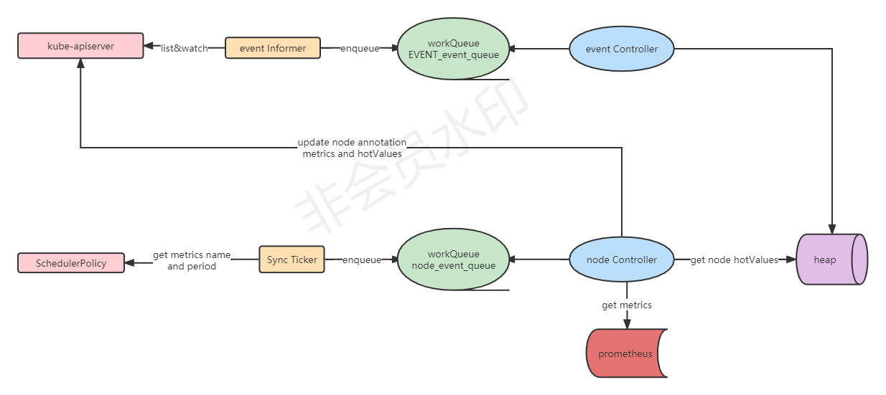

crane-scheduler 扩展了 k8s 原生调度器使其支持实时感知节点实际资源负载并且优化了热点调度，还支持基于节点拓扑的调度策略（待验证）。

**主要组件包含**：

##### 1、crane-scheduler-controller

该组件会间歇性通过 prometheus 获取各节点的监控指标以得到实时负载，并且会通过 kube-apiserver 获取节点对应的调度事件以判断该节点是否出现热点调度，最终将实时负载和热点调度信息通过注解形式更新到对应节点。

源码调用逻辑如下图所示



上图中存放 event 信息的 heap 是一个 BindingHeap 结构，该结构定义如下：

```go
//// pkg/controller/annotator/binding.go

// Binding is a concise struction of pod binding records,
// which consists of pod name, namespace name, node name and accurate timestamp.
// Note that we only record temporary Binding imformation.
type Binding struct {
	Node      string
	Namespace string
	PodName   string
	Timestamp int64
}

// BindingHeap is a Heap struction storing Binding imfromation.
type BindingHeap []*Binding
```

当 event Contoller 收到 event 以后会提取出 nodeName、namespace、podName、时间戳等信息并构造一个 Binding 对象推到栈上；node Controller 更新节点注解时会计算该节点 Hot value 值，计算逻辑是遍历调度策略配置里面 hotValue 数组，调用`**GetLastNodeBindingCount**`函数计算每一个配置的热点值最终进行累加，代码如下：

```go
//// pkg/controller/annotator/node.go - annotateNodeHotValue()
func annotateNodeHotValue(kubeClient clientset.Interface, br *BindingRecords, node *v1.Node, policy policy.DynamicSchedulerPolicy) error {
	var value int

    // 遍历调度策略配置HotValue字段，根据每一个策略计算出来的pod数量/p.count作为热点值，并进行累加
	for _, p := range policy.Spec.HotValue {
		value += br.GetLastNodeBindingCount(node.Name, p.TimeRange.Duration) / p.Count
	}

	return patchNodeAnnotation(kubeClient, node, HotValueKey, strconv.Itoa(value))
}

//// pkg/controller/annotator/node.go - GetLastNodeBindingCount()
// 计算对应节点在最近一段时间调度的pod数量
func (br *BindingRecords) GetLastNodeBindingCount(node string, timeRange time.Duration) int {
	br.rw.RLock()
	defer br.rw.RUnlock()

	cnt, timeline := 0, time.Now().UTC().Unix()-int64(timeRange.Seconds())

	for _, binding := range *br.bindings {
		if binding.Timestamp > timeline && binding.Node == node {
			cnt++
		}
	}

	klog.V(4).Infof("The total Binding count is %d, while node[%s] count is %d",
		len(*br.bindings), node, cnt)

	return cnt
}
```

##### 2、crane-scheduler

扩展了 kube-scheduler 的 `Filter`、`Score`等阶段，使得调度过程可以通过注解中的负载信息感知到该节点的实时负载。[官方文档](https://gocrane.io/zh-cn/docs/tutorials/dynamic-scheduler-plugin/)

crane-scheduler 也支持基于节点拓扑资源感知进行调度，该扩展插件默认为开启，需要 crane-agent 组件配合使用。[官方文档](https://gocrane.io/zh-cn/docs/tutorials/node-resource-tpolology-scheduler-plugins/)
