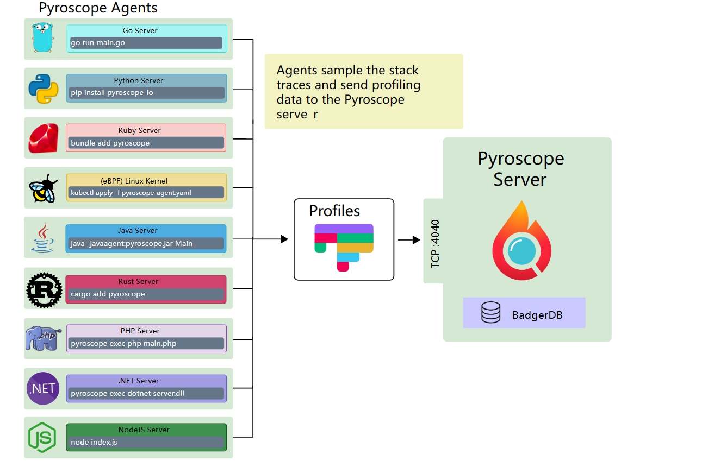
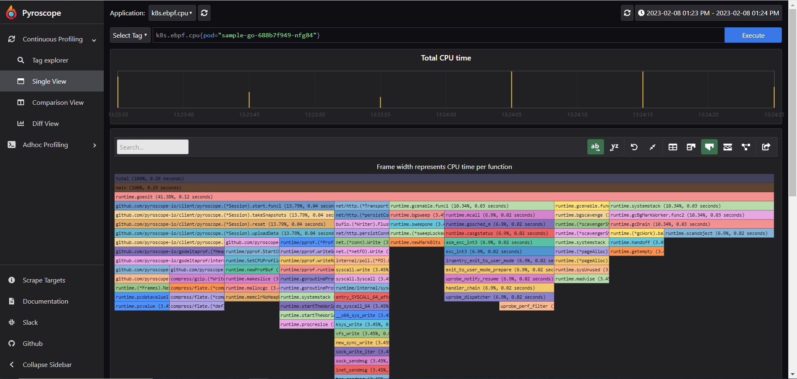
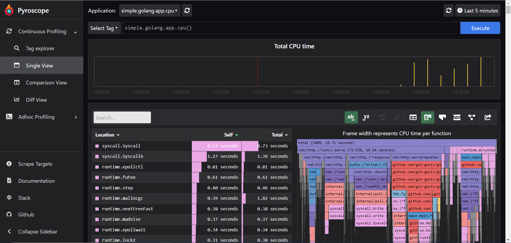
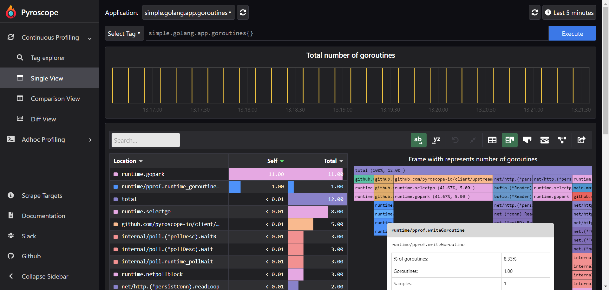

## Pyroscope（实时 profiling 平台）介绍

#### Pyroscope简介

Pyroscope 是一个开源的实时分析平台，使用 Go 语言实现。服务端使用 web 页面查看，提供丰富的分析的功能，客户端SDK提供Go、Java、Python、Ruby、PHP、.NET等多种语言的支持，也支持基于 eBPF 自动收集应用 Profiles，并且支持PUSH、PULL两种采集方式。



#### Pyroscpe Server 安装

以下主要介绍基于 K8S 环境部署

helm 部署

```shell
helm repo add pyroscope-io https://pyroscope-io.github.io/helm-chart
helm install -n demo pyroscope pyroscope-io/pyroscope 
```

验证应用是否正常启动

```shell
kubectl -n demo get pods
```

Server 正常启动以后，如果集群中已经配置好了 Ingress，那么加一条 ingress 指向 pyroscope service 即可通过域名访问；没有现成的 Ingress 可用则可以直接使用 NodePort 方式访问，直接修改 pyroscope service 为 NodePort 类型即可使用节点 IP: NodePort 访问。

#### 应用数据接入

这里我们主要介绍基于 K8S 环境和 Push 推送数据模式

##### eBPF Profiling

使用 eBPF 持续收集 Profile 数据，可以提供应用无侵入式分析数据，当前版本只支持 CPU Profiling。使用该方式会在每个节点部署一个 eBPF agent 并且支持不同的语言应用的数据收集。

###### 环境要求

- Linux 内核版本不低于 4.9 （依赖 [BPF_PROG_TYPE_PERF_EVENT](https://lkml.org/lkml/2016/9/1/831)）

###### 安装

```shell
$ helm repo add pyroscope-io https://pyroscope-io.github.io/helm-chart
$ helm install -n demo pyroscope-ebpf pyroscope-io/pyroscope-ebpf -f ebpf-vaules.yaml 


$cat ebpf-vaules.yaml 
image:
  # -- image to use for deploying
  repository: pyroscope/pyroscope
  # -- Image pull policy
  pullPolicy: IfNotPresent
  # -- Tag for pyroscope image to use
  tag: "0.37.1"


serviceAccount:
  # Specifies whether a service account should be created

  # -- Create service account
  create: true
# The name of the service account to use.
# If not set and create is true, a name is generated using the fullname template

  # -- Service account name to use, when empty will be set to created account if serviceAccount.create is set else to default
  name: ""
  # Annotations to add to the service account

  # -- ServiceAccount annotations
  annotations: {}


# -- Arguments to be passed to the pyroscope binary
args:
  - "ebpf"
  - "--application-name"
  - "k8s.ebpf"
  - "--server-address"
  - "http://pyroscope:4040"
```

###### 示例

以下为一个eBPF agent收集到的基于 Gin 框架的 web 示例程序 CPU 持续分析数据，该界面支持根据一些 k8s 自动注入的 labels 进行选择应用程序，这些 labels 包括 pod 自己定义的 lables 以及 node、namespace、podName等。时间选择上也比较灵活，可以选择最近某段时间或者在时间轴上自由拖拽。



##### Go Client

我们以Go Push方式为例。以下为一个使用 Gin 启动的 web 示例项目中加入了 pyroscope client 的代码：

```go
package main

import (
	"fmt"
	"os"

	"github.com/gin-gonic/gin"
	"github.com/pyroscope-io/client/pyroscope"
)

func main() {
	setPyroscope()
	r := gin.Default()
	r.GET("/", func(c *gin.Context) {
		hostname, err := os.Hostname()
		if err != nil {
			c.JSON(500, gin.H{
				"message": "Get hostname err",
			})
		}
		c.JSON(200, gin.H{
			"message": fmt.Sprintf("Hello! My name is %s, X-Real-IP is %s.", hostname, c.Request.Header.Get("X-Real-IP")),
		})
	})

	r.Run()
}

// pyroscope client代码
func setPyroscope() error {
	// These 2 lines are only required if you're using mutex or block profiling
	// Read the explanation below for how to set these rates:
	// runtime.SetMutexProfileFraction(5)
	// runtime.SetBlockProfileRate(5)

	_, err := pyroscope.Start(pyroscope.Config{
		ApplicationName: "simple.golang.app",

        ServerAddress: "http://pyroscope:4040",

		Logger: pyroscope.StandardLogger,

		Tags: map[string]string{"hostname": os.Getenv("HOSTNAME")},

		ProfileTypes: []pyroscope.ProfileType{
			pyroscope.ProfileCPU,
			pyroscope.ProfileAllocObjects,
			pyroscope.ProfileAllocSpace,
			pyroscope.ProfileInuseObjects,
			pyroscope.ProfileInuseSpace,

			pyroscope.ProfileGoroutines,
		},
	})
	if err != nil {
		return err
	}

	return nil
}
```

###### Profiling 示例

go client 支持的 profiles 类型如下：

默认开启的：

- ProfileCPU
- ProfileAllocObjects
- ProfileAllocSpace
- ProfileInuseObjects
- ProfileInuseSpace

可选类型：

- ProfileGoroutines
- ProfileMutexCount
- ProfileMutexDuration
- ProfileBlockCount
- ProfileBlockDuration

以下选择 CPU、Goroutine类型分析一下

**ProfileCPU**



**ProfileGoroutines**

