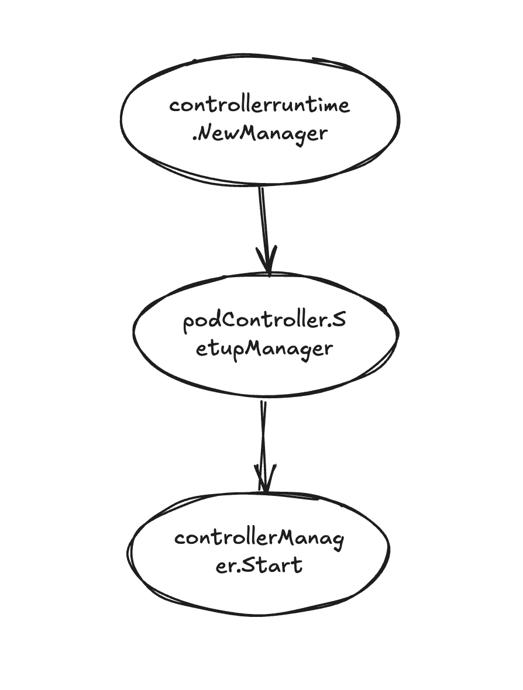
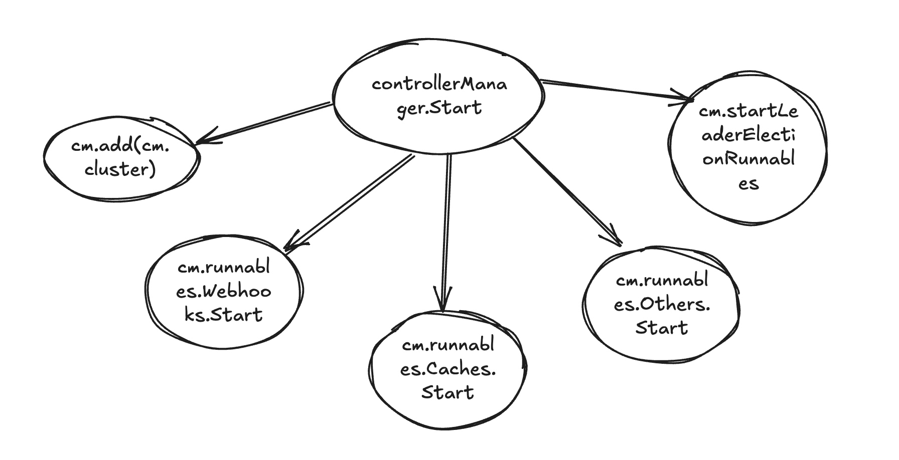
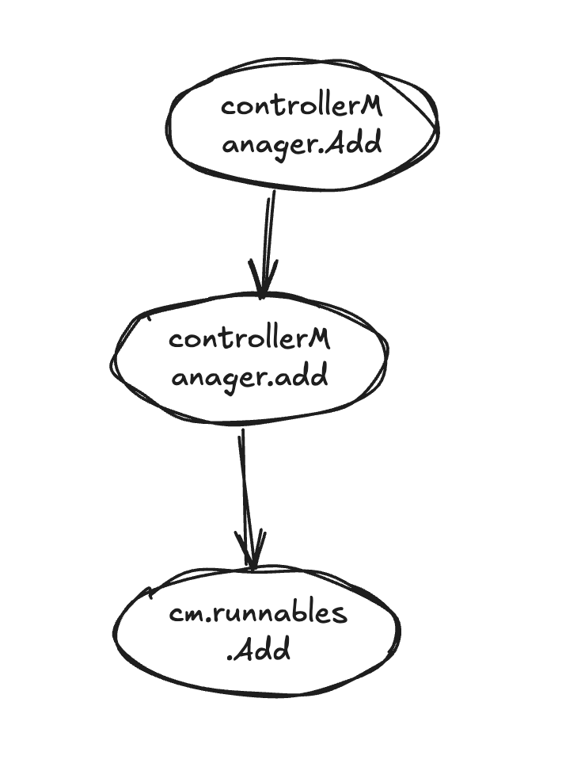
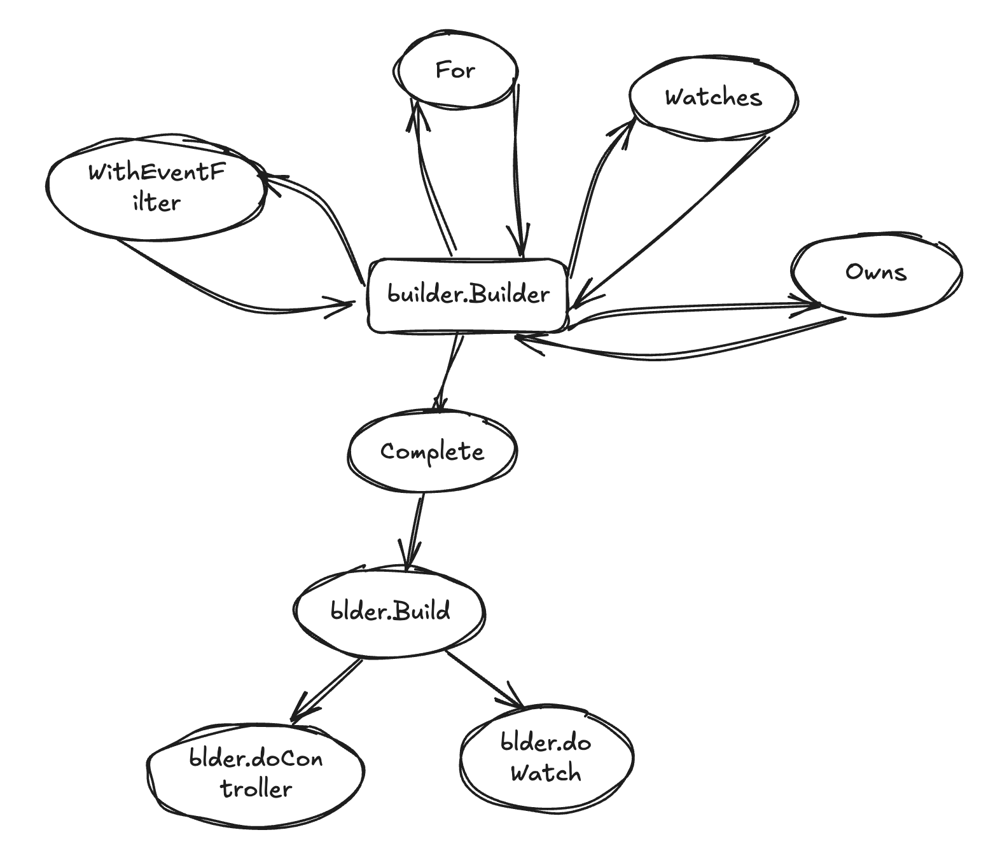
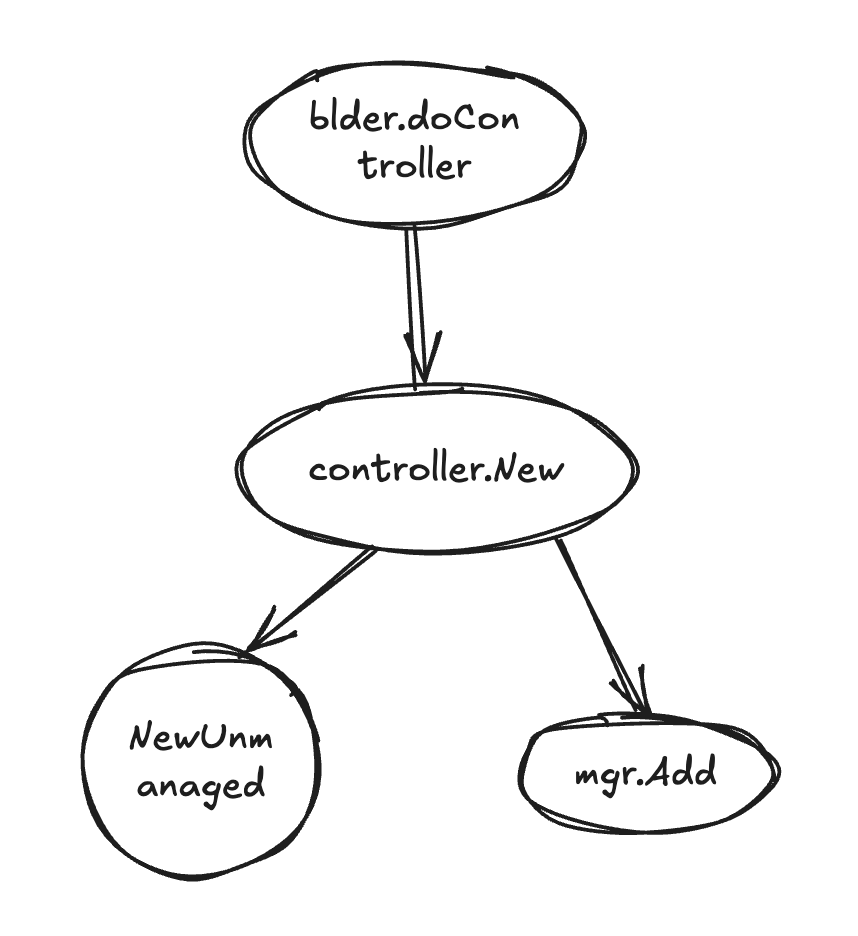

### 学习资料
- [controller-runtime中 For() 、Owns()、Watches()有什么区别](https://yash-kukreja-98.medium.com/develop-on-kubernetes-series-demystifying-the-for-vs-owns-vs-watches-controller-builders-in-c11ab32a046e)


### 源码分析

> 基于 controller-runtime 库 v0.15.0 版本

#### controllerManager启动流程

##### 使用 controllerManager 管理自己控制器



项目代码

```go
func Run() error {
	controllerManager, err := controllerruntime.NewManager(controlPlaneRestConfig, controllerruntime.Options{
		...
	})

  podController := &podController{
    ...
  }
	if err := podController.SetupWithManager(ctx.Mgr); err != nil {
		return false, err
	}
  
	err := controllerManager.Start(ctx)
	...
}
```

##### controllerManager 启动顺序



`controllerManager` 入口函数

源码位置：`sigs.k8s.io/controller-runtime/pkg/manager/internal.go`

```go
// Start starts the manager and waits indefinitely.
// There is only two ways to have start return:
// An error has occurred during in one of the internal operations,
// such as leader election, cache start, webhooks, and so on.
// Or, the context is cancelled.
func (cm *controllerManager) Start(ctx context.Context) (err error) {
	cm.Lock()
	if cm.started {
		cm.Unlock()
		return errors.New("manager already started")
	}
	cm.started = true

	var ready bool
	defer func() {
		// Only unlock the manager if we haven't reached
		// the internal readiness condition.
		if !ready {
			cm.Unlock()
		}
	}()

	// Initialize the internal context.
	cm.internalCtx, cm.internalCancel = context.WithCancel(ctx)

	// This chan indicates that stop is complete, in other words all runnables have returned or timeout on stop request
	stopComplete := make(chan struct{})
	defer close(stopComplete)
	// This must be deferred after closing stopComplete, otherwise we deadlock.
	defer func() {
		// https://hips.hearstapps.com/hmg-prod.s3.amazonaws.com/images/gettyimages-459889618-1533579787.jpg
		stopErr := cm.engageStopProcedure(stopComplete)
		if stopErr != nil {
			if err != nil {
				// Utilerrors.Aggregate allows to use errors.Is for all contained errors
				// whereas fmt.Errorf allows wrapping at most one error which means the
				// other one can not be found anymore.
				err = kerrors.NewAggregate([]error{err, stopErr})
			} else {
				err = stopErr
			}
		}
	}()

	// Add the cluster runnable.
	if err := cm.add(cm.cluster); err != nil {
		return fmt.Errorf("failed to add cluster to runnables: %w", err)
	}

	// Metrics should be served whether the controller is leader or not.
	// (If we don't serve metrics for non-leaders, prometheus will still scrape
	// the pod but will get a connection refused).
	if cm.metricsListener != nil {
		if err := cm.addMetricsServer(); err != nil {
			return fmt.Errorf("failed to add metrics server: %w", err)
		}
	}

	// Serve health probes.
	if cm.healthProbeListener != nil {
		cm.serveHealthProbes()
	}

	// Add pprof server
	if cm.pprofListener != nil {
		if err := cm.addPprofServer(); err != nil {
			return fmt.Errorf("failed to add pprof server: %w", err)
		}
	}

	// First start any webhook servers, which includes conversion, validation, and defaulting
	// webhooks that are registered.
	//
	// WARNING: Webhooks MUST start before any cache is populated, otherwise there is a race condition
	// between conversion webhooks and the cache sync (usually initial list) which causes the webhooks
	// to never start because no cache can be populated.
	if err := cm.runnables.Webhooks.Start(cm.internalCtx); err != nil {
		if err != nil {
			return fmt.Errorf("failed to start webhooks: %w", err)
		}
	}

	// Start and wait for caches.
	if err := cm.runnables.Caches.Start(cm.internalCtx); err != nil {
		if err != nil {
			return fmt.Errorf("failed to start caches: %w", err)
		}
	}

	// Start the non-leaderelection Runnables after the cache has synced.
	if err := cm.runnables.Others.Start(cm.internalCtx); err != nil {
		if err != nil {
			return fmt.Errorf("failed to start other runnables: %w", err)
		}
	}

	// Start the leader election and all required runnables.
	{
		ctx, cancel := context.WithCancel(context.Background())
		cm.leaderElectionCancel = cancel
		go func() {
			if cm.resourceLock != nil {
				if err := cm.startLeaderElection(ctx); err != nil {
					cm.errChan <- err
				}
			} else {
				// Treat not having leader election enabled the same as being elected.
				if err := cm.startLeaderElectionRunnables(); err != nil {
					cm.errChan <- err
				}
				close(cm.elected)
			}
		}()
	}

	ready = true
	cm.Unlock()
	select {
	case <-ctx.Done():
		// We are done
		return nil
	case err := <-cm.errChan:
		// Error starting or running a runnable
		return err
	}
}
```

##### `runnableGroup`  启动逻辑

```go
// sigs.k8s.io/controller-runtime/pkg/manager/runnable_group.go

// Start starts the group and waits for all
// initially registered runnables to start.
// It can only be called once, subsequent calls have no effect.
func (r *runnableGroup) Start(ctx context.Context) error {
	var retErr error

	r.startOnce.Do(func() {
		defer close(r.startReadyCh)

		// Start the internal reconciler.
		go r.reconcile()

		// Start the group and queue up all
		// the runnables that were added prior.
		r.start.Lock()
		r.started = true
		for _, rn := range r.startQueue {
			rn.signalReady = true
			r.ch <- rn
		}
		r.start.Unlock()

		// If we don't have any queue, return.
		if len(r.startQueue) == 0 {
			return
		}

		// Wait for all runnables to signal.
		for {
			select {
			case <-ctx.Done():
				if err := ctx.Err(); !errors.Is(err, context.Canceled) {
					retErr = err
				}
			case rn := <-r.startReadyCh:
				for i, existing := range r.startQueue {
					if existing == rn {
						// Remove the item from the start queue.
						r.startQueue = append(r.startQueue[:i], r.startQueue[i+1:]...)
						break
					}
				}
				// We're done waiting if the queue is empty, return.
				if len(r.startQueue) == 0 {
					return
				}
			}
		}
	})

	return retErr
}


// reconcile is our main entrypoint for every runnable added
// to this group. Its primary job is to read off the internal channel
// and schedule runnables while tracking their state.
func (r *runnableGroup) reconcile() {
	for runnable := range r.ch {
		// Handle stop.
		// If the shutdown has been called we want to avoid
		// adding new goroutines to the WaitGroup because Wait()
		// panics if Add() is called after it.
		{
			r.stop.RLock()
			if r.stopped {
				// Drop any runnables if we're stopped.
				r.errChan <- errRunnableGroupStopped
				r.stop.RUnlock()
				continue
			}

			// Why is this here?
			// When StopAndWait is called, if a runnable is in the process
			// of being added, we could end up in a situation where
			// the WaitGroup is incremented while StopAndWait has called Wait(),
			// which would result in a panic.
			r.wg.Add(1)
			r.stop.RUnlock()
		}

		// Start the runnable.
		go func(rn *readyRunnable) {
      // 异步执行Check函数做informer缓存同步
			go func() {
				if rn.Check(r.ctx) {
					if rn.signalReady {
						r.startReadyCh <- rn
					}
				}
			}()

			// If we return, the runnable ended cleanly
			// or returned an error to the channel.
			//
			// We should always decrement the WaitGroup here.
			defer r.wg.Done()

			// Start the runnable.
      // 控制器类型Start函数入口位置：pkg/internal/controller.Start()，执行控制器启动逻辑
			if err := rn.Start(r.ctx); err != nil {
				r.errChan <- err
			}
		}(runnable)
	}
}
```


注入 `Runnable` 到 `controllerManager`



`Runnable` 包含 `controller`、`webhook`、`LeaderElection` 等类型

```go
// sigs.k8s.io/controller-runtime/pkg/manager/internal.go
// Add sets dependencies on i, and adds it to the list of Runnables to start.
func (cm *controllerManager) Add(r Runnable) error {
	cm.Lock()
	defer cm.Unlock()
	return cm.add(r)
}

func (cm *controllerManager) add(r Runnable) error {
	return cm.runnables.Add(r)
}


// sigs.k8s.io/controller-runtime/pkg/manager/runnable_group.go
// Add adds a runnable to closest group of runnable that they belong to.
//
// Add should be able to be called before and after Start, but not after StopAndWait.
// Add should return an error when called during StopAndWait.
// The runnables added before Start are started when Start is called.
// The runnables added after Start are started directly.
func (r *runnables) Add(fn Runnable) error {
	switch runnable := fn.(type) {
  // 控制器类型加入controllerManager.runnables.Cache组中
	case hasCache:
		return r.Caches.Add(fn, func(ctx context.Context) bool {
			return runnable.GetCache().WaitForCacheSync(ctx)
		})
  // webhook
	case webhook.Server:
		return r.Webhooks.Add(fn, nil)
	case LeaderElectionRunnable:
		if !runnable.NeedLeaderElection() {
			return r.Others.Add(fn, nil)
		}
		return r.LeaderElection.Add(fn, nil)
	default:
		return r.LeaderElection.Add(fn, nil)
	}
}


// Add should be able to be called before and after Start, but not after StopAndWait.
// Add should return an error when called during StopAndWait.
func (r *runnableGroup) Add(rn Runnable, ready runnableCheck) error {
	r.stop.RLock()
	if r.stopped {
		r.stop.RUnlock()
		return errRunnableGroupStopped
	}
	r.stop.RUnlock()

	if ready == nil {
		ready = func(_ context.Context) bool { return true }
	}

	readyRunnable := &readyRunnable{
		Runnable: rn,
		Check:    ready,
	}

	// Handle start.
	// If the overall runnable group isn't started yet
	// we want to buffer the runnables and let Start()
	// queue them up again later.
	{
		r.start.Lock()

		// Check if we're already started.
		if !r.started {
			// Store the runnable in the internal if not.
			r.startQueue = append(r.startQueue, readyRunnable)
			r.start.Unlock()
			return nil
		}
		r.start.Unlock()
	}

	// Enqueue the runnable.
	r.ch <- readyRunnable
	return nil
}
```


#### 使用 Builder 注册业务控制器



```go
// SetupWithManager creates a controller and register to controller manager.
func (c *podController) SetupWithManager(mgr controllerruntime.Manager) error {
	return controllerruntime.NewControllerManagedBy(mgr).
		For(&corev1.pod{}, builder.WithPredicates(c.PredicateFunc)).
		WithEventFilter(predicate.GenerationChangedPredicate{}).
		Complete(c)
}
```


源码位置：`sigs.k8s.io/controller-runtime/pkg/builder/controller.go`

```go
// Build builds the Application Controller and returns the Controller it created.
func (blder *Builder) Build(r reconcile.Reconciler) (controller.Controller, error) {
	...

	// Set the ControllerManagedBy
	if err := blder.doController(r); err != nil {
		return nil, err
	}

	// Set the Watch
	if err := blder.doWatch(); err != nil {
		return nil, err
	}

	return blder.ctrl, nil
}
```


##### doController 逻辑



源码位置：`sigs.k8s.io/controller-runtime/pkg/builder/controller.go`

```go
func (blder *Builder) doController(r reconcile.Reconciler) error {
	globalOpts := blder.mgr.GetControllerOptions()

	ctrlOptions := blder.ctrlOptions
	if ctrlOptions.Reconciler == nil {
		ctrlOptions.Reconciler = r
	}

	// Retrieve the GVK from the object we're reconciling
	// to prepopulate logger information, and to optionally generate a default name.
	var gvk schema.GroupVersionKind
	hasGVK := blder.forInput.object != nil
	if hasGVK {
		var err error
		gvk, err = getGvk(blder.forInput.object, blder.mgr.GetScheme())
		if err != nil {
			return err
		}
	}

	// Setup concurrency.
	if ctrlOptions.MaxConcurrentReconciles == 0 && hasGVK {
		groupKind := gvk.GroupKind().String()

		if concurrency, ok := globalOpts.GroupKindConcurrency[groupKind]; ok && concurrency > 0 {
			ctrlOptions.MaxConcurrentReconciles = concurrency
		}
	}

	// Setup cache sync timeout.
	if ctrlOptions.CacheSyncTimeout == 0 && globalOpts.CacheSyncTimeout > 0 {
		ctrlOptions.CacheSyncTimeout = globalOpts.CacheSyncTimeout
	}

	controllerName, err := blder.getControllerName(gvk, hasGVK)
	if err != nil {
		return err
	}

	// Setup the logger.
	if ctrlOptions.LogConstructor == nil {
    ...
	}

	// Build the controller and return.
	blder.ctrl, err = newController(controllerName, blder.mgr, ctrlOptions)
	return err
}


var newController = controller.New
// New returns a new Controller registered with the Manager.  The Manager will ensure that shared Caches have
// been synced before the Controller is Started.
func New(name string, mgr manager.Manager, options Options) (Controller, error) {
	c, err := NewUnmanaged(name, mgr, options)
	if err != nil {
		return nil, err
	}

	// Add the controller as a Manager components
	return c, mgr.Add(c)
}
```


##### `doWatch` 函数入口

```go
// sigs.k8s.io/controller-runtime/pkg/builder/controller.go

func (blder *Builder) doWatch() error {
  // 监听For()函数绑定的资源
	if blder.forInput.object != nil {
		obj, err := blder.project(blder.forInput.object, blder.forInput.objectProjection)
		if err != nil {
			return err
		}
		src := source.Kind(blder.mgr.GetCache(), obj)
		hdler := &handler.EnqueueRequestForObject{}
		allPredicates := append(blder.globalPredicates, blder.forInput.predicates...)
    // Watch主逻辑
		if err := blder.ctrl.Watch(src, hdler, allPredicates...); err != nil {
			return err
		}
	}

	// 监听Owns()函数绑定的资源
	if len(blder.ownsInput) > 0 && blder.forInput.object == nil {
		return errors.New("Owns() can only be used together with For()")
	}
	for _, own := range blder.ownsInput {
		obj, err := blder.project(own.object, own.objectProjection)
		if err != nil {
			return err
		}
		src := source.Kind(blder.mgr.GetCache(), obj)
		opts := []handler.OwnerOption{}
		if !own.matchEveryOwner {
			opts = append(opts, handler.OnlyControllerOwner())
		}
		hdler := handler.EnqueueRequestForOwner(
			blder.mgr.GetScheme(), blder.mgr.GetRESTMapper(),
			blder.forInput.object,
			opts...,
		)
		allPredicates := append([]predicate.Predicate(nil), blder.globalPredicates...)
		allPredicates = append(allPredicates, own.predicates...)
		if err := blder.ctrl.Watch(src, hdler, allPredicates...); err != nil {
			return err
		}
	}

	// 监听Watches()函数绑定的资源
	if len(blder.watchesInput) == 0 && blder.forInput.object == nil {
		return errors.New("there are no watches configured, controller will never get triggered. Use For(), Owns() or Watches() to set them up")
	}
	for _, w := range blder.watchesInput {
		allPredicates := append([]predicate.Predicate(nil), blder.globalPredicates...)
		allPredicates = append(allPredicates, w.predicates...)

		// If the source of this watch is of type Kind, project it.
		if srckind, ok := w.src.(*internalsource.Kind); ok {
			typeForSrc, err := blder.project(srckind.Type, w.objectProjection)
			if err != nil {
				return err
			}
			srckind.Type = typeForSrc
		}

		if err := blder.ctrl.Watch(w.src, w.eventhandler, allPredicates...); err != nil {
			return err
		}
	}
	return nil
}
```

`Watch`函数实现

```go
// sigs.k8s.io/controller-runtime/pkg/internal/controller/controller.go
func (c *Controller) Watch(src source.Source, evthdler handler.EventHandler, prct ...predicate.Predicate) error {
	c.mu.Lock()
	defer c.mu.Unlock()

	// Controller hasn't started yet, store the watches locally and return.
	//
	// These watches are going to be held on the controller struct until the manager or user calls Start(...).
	if !c.Started {
		c.startWatches = append(c.startWatches, watchDescription{src: src, handler: evthdler, predicates: prct})
		return nil
	}

	c.LogConstructor(nil).Info("Starting EventSource", "source", src)
	return src.Start(c.ctx, evthdler, c.Queue, prct...)
}

// 监听集群内部资源类型source启动函数
// Start is internal and should be called only by the Controller to register an EventHandler with the Informer to enqueue reconcile.Requests.
func (ks *Kind) Start(ctx context.Context, handler handler.EventHandler, queue workqueue.RateLimitingInterface,
	prct ...predicate.Predicate) error {
	...

	// cache.GetInformer will block until its context is cancelled if the cache was already started and it can not
	// sync that informer (most commonly due to RBAC issues).
	ctx, ks.startCancel = context.WithCancel(ctx)
	ks.started = make(chan error)
	go func() {
		...

    // 创建EventHandler
		_, err := i.AddEventHandler(NewEventHandler(ctx, queue, handler, prct).HandlerFuncs())
		if err != nil {
			ks.started <- err
			return
		}
    // 异步等待cache同步完成
		if !ks.Cache.WaitForCacheSync(ctx) {
			// Would be great to return something more informative here
			ks.started <- errors.New("cache did not sync")
		}
		close(ks.started)
	}()

	return nil
}
```

