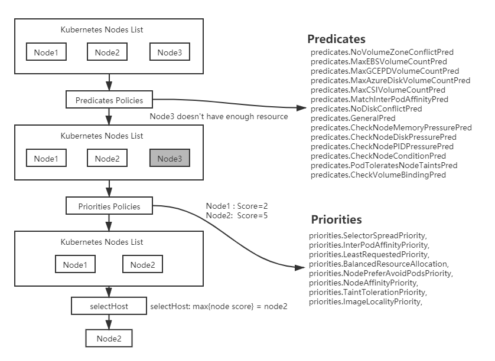
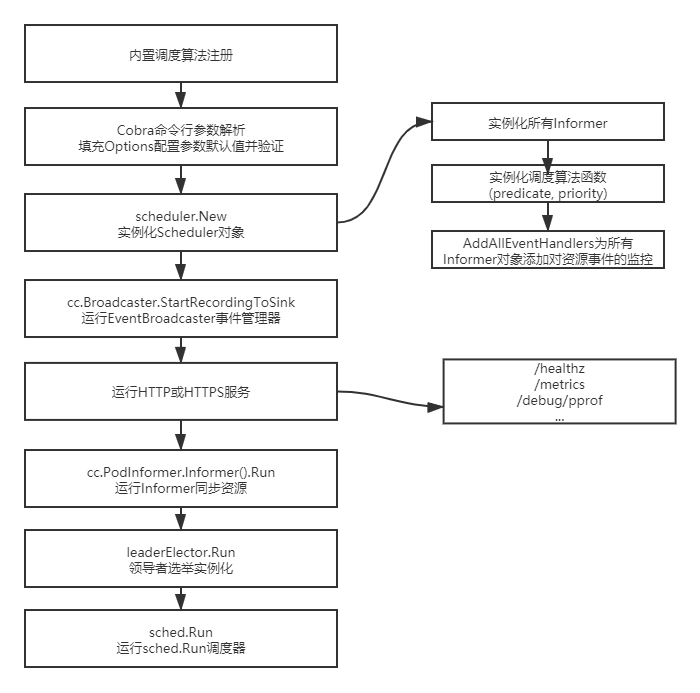

### 1.1 Kube-scheduler 架构设计详解

kube-scheduler 调度器在为 Pod 资源对象选择合适节点时的两种最优解：

- 全局最优解：是指每个调度器周期都会遍历 Kubernetes 集群中的所有节点，以便找出全局最优的节点。
- 局部最优解：是指每个调度周期只会遍历部分 Kubernetes 集群中的节点，找出局部最优的节点。(上千台以后可以考虑)

kube-scheduler组建的主要逻辑在于，如何在Kubernetes集群中为每一个Pod资源对象找出合适的节点。调度器每次只调度一个Pod资源对象，为每一个Pod资源对象寻找合适节点的过程就是一个调度周期。kube-scheduler 组件的架构设计如下图：



### 1.2 Kube-scheduler 组件启动流程

启动流程图如下所示： 



#### 1.2.1 内置调度算法注册

内置调度算法的注册过程与kube-apiserver资源注册过程类似，它们都通过Go语言的导入和初始化机制触发的。当引用 `k8s.io/kubernetes/pkg/scheduler/algorithmprovider`包时，就会自动调度包下的 init 初始化函数，代码示例如下：

```go
// 路径： pkg/scheduler/factory/plugins.go
var (
	fitPredicateMap        = make(map[string]FitPredicateFactory) //存储所有预选调度算法
	priorityFunctionMap    = make(map[string]PriorityConfigFactory) // 存储所有的优选调度算法
	algorithmProviderMap   = make(map[string]AlgorithmProviderConfig) // 存储所有类型调度算法名字
)
```

```go
// 路径：cmd/kube-scheduler/app/server.go
import (
...
"k8s.io/kubernetes/pkg/scheduler/algorithmprovider"
...
)
```

```go
// 路径： pkg/scheduler/algorithmprovider/default/default.go
...
func init() {
	registerAlgorithmProvider(defaultPredicates(), defaultPriorities())
}

// 注册预选和优选调度算法到algorithmProviderMap
func registerAlgorithmProvider(predSet, priSet sets.String) {
	factory.RegisterAlgorithmProvider(factory.DefaultProvider, predSet, priSet)
	factory.RegisterAlgorithmProvider(ClusterAutoscalerProvider, predSet,
		copyAndReplace(priSet, priorities.LeastRequestedPriority, priorities.MostRequestedPriority))
}

// 预选算法集合
func defaultPredicates() sets.String {
	return sets.NewString(
		predicates.NoVolumeZoneConflictPred,
		predicates.MaxEBSVolumeCountPred,
		predicates.MaxGCEPDVolumeCountPred,
		predicates.MaxAzureDiskVolumeCountPred,
		predicates.MaxCSIVolumeCountPred,
		predicates.MatchInterPodAffinityPred,
		predicates.NoDiskConflictPred,
		predicates.GeneralPred,
		predicates.CheckNodeMemoryPressurePred,
		predicates.CheckNodeDiskPressurePred,
		predicates.CheckNodePIDPressurePred,
		predicates.CheckNodeConditionPred,
		predicates.PodToleratesNodeTaintsPred,
		predicates.CheckVolumeBindingPred,
	)
}

// 优选算法集合
func defaultPriorities() sets.String {
	return sets.NewString(
		priorities.SelectorSpreadPriority,
		priorities.InterPodAffinityPriority,
		priorities.LeastRequestedPriority,
		priorities.BalancedResourceAllocation,
		priorities.NodePreferAvoidPodsPriority,
		priorities.NodeAffinityPriority,
		priorities.TaintTolerationPriority,
		priorities.ImageLocalityPriority,
	)
}
```

```
// 路径： pkg/scheduler/algorithmprovider/default/register_predicates.go
// 初始化所有预选调度算法
func init() {
	...
	factory.RegisterFitPredicate("PodFitsPorts", predicates.PodFitsHostPorts)
	factory.RegisterFitPredicate(predicates.PodFitsHostPortsPred, predicates.PodFitsHostPorts)
	factory.RegisterFitPredicate(predicates.PodFitsResourcesPred, predicates.PodFitsResources)
	factory.RegisterFitPredicate(predicates.HostNamePred, predicates.PodFitsHost)
	factory.RegisterFitPredicate(predicates.MatchNodeSelectorPred, predicates.PodMatchNodeSelector)

	factory.RegisterFitPredicateFactory(
		predicates.NoVolumeZoneConflictPred,
		func(args factory.PluginFactoryArgs) predicates.FitPredicate {
			return predicates.NewVolumeZonePredicate(args.PVInfo, args.PVCInfo, args.StorageClassInfo)
		},
	)
	...
}
```

```
// 路径： pkg/scheduler/algorithmprovider/default/register_priorities.go
// 初始化所有优选调度算法
func init() {
	...
}
```

#### 1.2.2 Cobra命令行参数解析

Cobra是Kubernetes系统中统一的命令行参数解析库，所有的Kubernetes组件都使用Cobra来解析命令行参数。kube-scheduler组件通过Cobra填充Options配置参数默认值并验证参数，代码示例如下：

```go
// 路径：cmd/kube-scheduler/app/server.go
func NewSchedulerCommand() *cobra.Command {
	// 初始化调度器默认的配置选项
	opts, err := options.NewOptions()
	...

	cmd := &cobra.Command{
		...
		Run: func(cmd *cobra.Command, args []string) {
            // 命令行入口函数
			if err := runCommand(cmd, args, opts); err != nil {
				fmt.Fprintf(os.Stderr, "%v\n", err)
				os.Exit(1)
			}
		},
	}
	...
}

func runCommand(cmd *cobra.Command, args []string, opts *options.Options) error {
	...
	// 验证配置参数合法性和可用性
	if errs := opts.Validate(); len(errs) > 0 {
		os.Exit(1)
	}
	...
    
	c, err := opts.Config()

	// 填充部分字段并获取apiserver认证和授权信息，并返回CompletedConfig对象
	cc := c.Complete()

	...
	// 加载CompletedConfig对象并执行kube-scheduler组件启动逻辑
	return Run(cc, stopCh)
}
```

#### 1.2.3 实例化 Scheduler 对象

Scheduler 对象是运行 kube-scheduler 组件的主对象，它包含了 kube-scheduler 组件运行过程中所有依赖模块对象。实例化过程主要包含3部分：

- 第1部分：实例化所有 Informer；
- 第2部分： 实例化调度算法；
- 第3部分：为所有 Informer 对象添加资源事件的监控；

Run 函数执行逻辑第一步就是实例化 Scheduler 对象，代码如下：

```go
// 路径：cmd/kube-scheduler/app/server.go
func Run(cc schedulerserverconfig.CompletedConfig, stopCh <-chan struct{}) error {
	// To help debugging, immediately log version
	klog.V(1).Infof("Starting Kubernetes Scheduler version %+v", version.Get())

	// 实例化Scheduler对象，New函数参数传入了所有依赖的Informer对象
	sched, err := scheduler.New(cc.Client,
		cc.InformerFactory.Core().V1().Nodes(),
		cc.PodInformer,
		cc.InformerFactory.Core().V1().PersistentVolumes(),
		cc.InformerFactory.Core().V1().PersistentVolumeClaims(),
		cc.InformerFactory.Core().V1().ReplicationControllers(),
		cc.InformerFactory.Apps().V1().ReplicaSets(),
		cc.InformerFactory.Apps().V1().StatefulSets(),
		cc.InformerFactory.Core().V1().Services(),
		cc.InformerFactory.Policy().V1beta1().PodDisruptionBudgets(),
		cc.InformerFactory.Storage().V1().StorageClasses(),
		cc.Recorder,
		cc.ComponentConfig.AlgorithmSource,
		stopCh,
		framework.NewRegistry(),
		cc.ComponentConfig.Plugins,
		cc.ComponentConfig.PluginConfig,
		scheduler.WithName(cc.ComponentConfig.SchedulerName),
		scheduler.WithHardPodAffinitySymmetricWeight(cc.ComponentConfig.HardPodAffinitySymmetricWeight),
		scheduler.WithPreemptionDisabled(cc.ComponentConfig.DisablePreemption),
		scheduler.WithPercentageOfNodesToScore(cc.ComponentConfig.PercentageOfNodesToScore),
		scheduler.WithBindTimeoutSeconds(*cc.ComponentConfig.BindTimeoutSeconds))
	if err != nil {
		return err
	}
}
```

New函数实现逻辑代码：

```go
// 路径：pkg/scheduler/scheduler.go
func New(client clientset.Interface,
	nodeInformer coreinformers.NodeInformer,
	podInformer coreinformers.PodInformer,
	pvInformer coreinformers.PersistentVolumeInformer,
	pvcInformer coreinformers.PersistentVolumeClaimInformer,
	replicationControllerInformer coreinformers.ReplicationControllerInformer,
	replicaSetInformer appsinformers.ReplicaSetInformer,
	statefulSetInformer appsinformers.StatefulSetInformer,
	serviceInformer coreinformers.ServiceInformer,
	pdbInformer policyinformers.PodDisruptionBudgetInformer,
	storageClassInformer storageinformers.StorageClassInformer,
	recorder record.EventRecorder,
	schedulerAlgorithmSource kubeschedulerconfig.SchedulerAlgorithmSource,
	stopCh <-chan struct{},
	registry framework.Registry,
	plugins *kubeschedulerconfig.Plugins,
	pluginConfig []kubeschedulerconfig.PluginConfig,
	opts ...func(o *schedulerOptions)) (*Scheduler, error) {

	options := defaultSchedulerOptions
	for _, opt := range opts {
		opt(&options)
	}
	// 实例化Configurator接口用于后续获取调度策略
	configurator := factory.NewConfigFactory(&factory.ConfigFactoryArgs{
		SchedulerName:                  options.schedulerName,
		Client:                         client,
		NodeInformer:                   nodeInformer,
		PodInformer:                    podInformer,
		PvInformer:                     pvInformer,
		PvcInformer:                    pvcInformer,
		ReplicationControllerInformer:  replicationControllerInformer,
		ReplicaSetInformer:             replicaSetInformer,
		StatefulSetInformer:            statefulSetInformer,
		ServiceInformer:                serviceInformer,
		PdbInformer:                    pdbInformer,
		StorageClassInformer:           storageClassInformer,
		HardPodAffinitySymmetricWeight: options.hardPodAffinitySymmetricWeight,
		DisablePreemption:              options.disablePreemption,
		PercentageOfNodesToScore:       options.percentageOfNodesToScore,
		BindTimeoutSeconds:             options.bindTimeoutSeconds,
		Registry:                       registry,
		Plugins:                        plugins,
		PluginConfig:                   pluginConfig,
	})
	var config *factory.Config
	source := schedulerAlgorithmSource
	switch {
	case source.Provider != nil:
		// 通过provider名称方式实例化调度算法，默认方式
		sc, err := configurator.CreateFromProvider(*source.Provider)
		if err != nil {
			return nil, fmt.Errorf("couldn't create scheduler using provider %q: %v", *source.Provider, err)
		}
		config = sc
	case source.Policy != nil:
		// 通过Policy文件实例化调度算法函数
		policy := &schedulerapi.Policy{}
		switch {
		case source.Policy.File != nil:
			if err := initPolicyFromFile(source.Policy.File.Path, policy); err != nil {
				return nil, err
			}
		case source.Policy.ConfigMap != nil:
			if err := initPolicyFromConfigMap(client, source.Policy.ConfigMap, policy); err != nil {
				return nil, err
			}
		}
		sc, err := configurator.CreateFromConfig(*policy)
		if err != nil {
			return nil, fmt.Errorf("couldn't create scheduler from policy: %v", err)
		}
		config = sc
	default:
		return nil, fmt.Errorf("unsupported algorithm source: %v", source)
	}
	// Additional tweaks to the config produced by the configurator.
	config.Recorder = recorder
	config.DisablePreemption = options.disablePreemption
	config.StopEverything = stopCh

	// 创建scheduler对象
	sched := NewFromConfig(config)

    // 为所有Informer添加事件监控
	AddAllEventHandlers(sched, options.schedulerName, nodeInformer, podInformer, pvInformer, pvcInformer, serviceInformer, storageClassInformer)
	return sched, nil
}
```

#### 1.2.4 运行 EventBroadcaster 事件管理器

kube-scheduler组件会将运行时产生的各种事件上报给 kubernetes API Server。cc.Broadcaster通过StartLogging自定义函数将时间输出至klog stdout 标准输出，通过 StartRecordingToSink 自定义函数将关键性事件上报给kubernetes API Server。

```
// 路径：cmd/kube-scheduler/app/server.go
func Run(cc schedulerserverconfig.CompletedConfig, stopCh <-chan struct{}) error {
	...
	// 启动时间管理器
	if cc.Broadcaster != nil && cc.EventClient != nil {
		cc.Broadcaster.StartLogging(klog.V(6).Infof)
		cc.Broadcaster.StartRecordingToSink(&v1core.EventSinkImpl{Interface: cc.EventClient.Events("")})
	}
	...
}
```

#### 1.2.5 运行HTTP 或 HTTPS 服务

kube-scheduler 组件也拥有自己的 HTTP 服务，但功能仅限于监控及健康检查等。提供的几个重要接口如下：

- /healthz：用于健康检查
- /metrics：用于监控指标，一般用于 Prometheus 指标采集。
- /debug/pprof：用于 pprof 性能分析。

#### 1.2.6 运行 Informer 同步资源

```
// 路径：cmd/kube-scheduler/app/server.go
func Run(cc schedulerserverconfig.CompletedConfig, stopCh <-chan struct{}) error {
	...
	// 启动所有Informer监控所有资源
	go cc.PodInformer.Informer().Run(stopCh)
	cc.InformerFactory.Start(stopCh)

	// 调度器启动之前，通过该函数等待所有运行中的Informer数据同步，是本地缓存数据与Etcd集群中数据保持一致
	cc.InformerFactory.WaitForCacheSync(stopCh)
	...
}
```

#### 1.2.7 领导者选举实例化

领导者选举机制的目的是实现 Kubernetes 组件的高可用，在领导者选举实例化过程中，会定义 Callback 函数，代码示例如下：

```
// 路径：cmd/kube-scheduler/app/server.go
func Run(cc schedulerserverconfig.CompletedConfig, stopCh <-chan struct{}) error {
	...
	if cc.LeaderElection != nil {
		cc.LeaderElection.Callbacks = leaderelection.LeaderCallbacks{
			// OnStartedLeading函数是当前节点领导者选举成功后回调的函数，该函数定义了kube-scheduler组件的主逻辑。
			OnStartedLeading: run,
			// OnStoppedLeading函数是当前节点领导者选举失败后回调的函数，控制kube-scheduler的正常退出。
			OnStoppedLeading函数是当前节点领导者: func() {
				utilruntime.HandleError(fmt.Errorf("lost master"))
			},
		}
		leaderElector, err := leaderelection.NewLeaderElector(*cc.LeaderElection)
		if err != nil {
			return fmt.Errorf("couldn't create leader elector: %v", err)
		}

		leaderElector.Run(ctx)

		return fmt.Errorf("lost lease")
	}	
	...
}
```

#### 1.2.8 运行 sched.Run 调度器

```
// 路径：pkg/scheduler/scheduler.go
func (sched *Scheduler) Run() {
	// 正式运行kube-scheduler主逻辑之前，再次确认所有Informer数据是否已经同步到本地
	if !sched.config.WaitForCacheSync() {
		return
	}

	// sched.scheduleOne是scheduler主逻辑入口，它通过wait.Until定时器执行，内部会定时调用sched.scheduleOne函数，当sched.config.StopEverything chan关闭时该定时器会停止退出
	go wait.Until(sched.scheduleOne, 0, sched.config.StopEverything)
}
```

