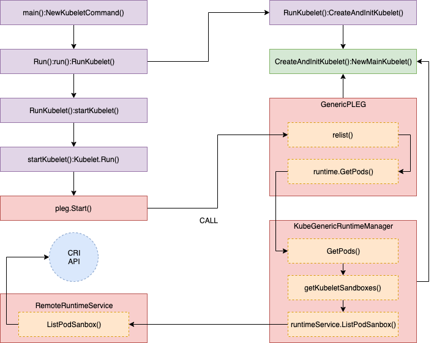

### kubelet源码分析二：PLEG实现分析

#### 什么是PLEG?

kublet 中的 PLEG 模块通过获取每一个 pod 级的事件来调整容器运行时状态，并实时更新 pod cache。

PLEG 在 kubelet 中的位置如下所示：


#### “PLEG is not healthy”是怎么发生的？

kubelet 在 `SyncLoop()` 函数中通过间歇性的调用 `Healthy()` 函数 来检查 PLEG 状态健康。

`Healthy()` 函数会检查 `relist` 过程是否在3分钟内完成，这个函数被作为 "PLEG" 添加到 `runtimeState` 并且会被 "SyncLoop" 间歇性(默认10s)的调用。如果 ”relist“ 过程超过3分钟，"PLEG is not healthy" 的信息会被上报到日志里。


```go
//// pkg/kubelet/pleg/generic.go - Healthy()

// The threshold needs to be greater than the relisting period + the
// relisting time, which can vary significantly. Set a conservative
// threshold to avoid flipping between healthy and unhealthy.
relistThreshold = 3 * time.Minute
:
func (g *GenericPLEG) Healthy() (bool, error) {
  relistTime := g.getRelistTime()
  elapsed := g.clock.Since(relistTime)
  if elapsed > relistThreshold {
	return false, fmt.Errorf("pleg was last seen active %v ago; threshold is %v", elapsed, relistThreshold)
  }
  return true, nil
}

//// pkg/kubelet/kubelet.go - NewMainKubelet()
func NewMainKubelet(kubeCfg *kubeletconfiginternal.KubeletConfiguration, ...
:
  klet.runtimeState.addHealthCheck("PLEG", klet.pleg.Healthy)

//// pkg/kubelet/kubelet.go - syncLoop()
func (kl *Kubelet) syncLoop(updates <-chan kubetypes.PodUpdate, handler SyncHandler) {
:
// The resyncTicker wakes up kubelet to checks if there are any pod workers
// that need to be sync'd. A one-second period is sufficient because the
// sync interval is defaulted to 10s.
:
  const (
	base   = 100 * time.Millisecond
	max	= 5 * time.Second
	factor = 2
  )
  duration := base
  for {
      if rs := kl.runtimeState.runtimeErrors(); len(rs) != 0 {
   	   glog.Infof("skipping pod synchronization - %v", rs)
   	   // exponential backoff
   	   time.Sleep(duration)
   	   duration = time.Duration(math.Min(float64(max), factor*float64(duration)))
   	   continue
      }
	:
  }
:
}

//// pkg/kubelet/runtime.go - runtimeErrors()
func (s *runtimeState) runtimeErrors() []string {
:
    for _, hc := range s.healthChecks {
   	 if ok, err := hc.fn(); !ok {
   		 ret = append(ret, fmt.Sprintf("%s is not healthy: %v", hc.name, err))
   	 }
    }
:
}
```


#### Relist 过程

接下来我们看看 `relist` 过程的细节，你必须非常关注这个远程调用以及如何处理拉取到的数据，因为这部分很容易遇到瓶颈。


```go
//// pkg/kubelet/pleg/generic.go

// 生成一个间歇性执行relist的goroutine
func (g *GenericPLEG) Start() {
    // 执行完g.relist函数后间隔g.relistPeriod再执行relist函数
	go wait.Until(g.relist, g.relistPeriod, wait.NeverStop)
}

// 请求容器运行时来list和对比pod/containers，从而生成事件
func (g *GenericPLEG) relist() {
	klog.V(5).InfoS("GenericPLEG: Relisting")

	if lastRelistTime := g.getRelistTime(); !lastRelistTime.IsZero() {
		metrics.PLEGRelistInterval.Observe(metrics.SinceInSeconds(lastRelistTime))
	}

	timestamp := g.clock.Now()
	defer func() {
		metrics.PLEGRelistDuration.Observe(metrics.SinceInSeconds(timestamp))
	}()

	// 通过grpc调用运行时的cri接口获取节点上所有podSandbox和container数据并组装成kubecontainer.Pod数据结构列表
	podList, err := g.runtime.GetPods(true)
	if err != nil {
		klog.ErrorS(err, "GenericPLEG: Unable to retrieve pods")
		return
	}

    // 更新relistTime为当前时间
	g.updateRelistTime(timestamp)

	pods := kubecontainer.Pods(podList)
	// update running pod and container count
	updateRunningPodAndContainerMetrics(pods)
    // 将g.podRecords中代表当前pod状态的current字段更新为pods中对应的pod
	g.podRecords.setCurrent(pods)

	// 对比老pod和当前pod,然后生成事件
	eventsByPodID := map[types.UID][]*PodLifecycleEvent{}
	for pid := range g.podRecords {
		oldPod := g.podRecords.getOld(pid)
		pod := g.podRecords.getCurrent(pid)
		// 根据container ID去重获取所有container
		allContainers := getContainersFromPods(oldPod, pod)
		for _, container := range allContainers {
            // 生成pod事件并更新到eventsByPodID
			events := computeEvents(oldPod, pod, &container.ID)
			for _, e := range events {
				updateEvents(eventsByPodID, e)
			} 
		}
	}

	var needsReinspection map[types.UID]*kubecontainer.Pod
	if g.cacheEnabled() {
		needsReinspection = make(map[types.UID]*kubecontainer.Pod)
	}

	// If there are events associated with a pod, we should update the
	// podCache.
	for pid, events := range eventsByPodID {
		pod := g.podRecords.getCurrent(pid)
		if g.cacheEnabled() {
			// 更新g.cache中pod状态，如果失败该pod则会进入needsReinspection中在下一次pleg中重新relist
			if err := g.updateCache(pod, pid); err != nil {
				// Rely on updateCache calling GetPodStatus to log the actual error.
				klog.V(4).ErrorS(err, "PLEG: Ignoring events for pod", "pod", klog.KRef(pod.Namespace, pod.Name))

				// make sure we try to reinspect the pod during the next relisting
				needsReinspection[pid] = pod

				continue
			} else {
				// this pod was in the list to reinspect and we did so because it had events, so remove it
				// from the list (we don't want the reinspection code below to inspect it a second time in
				// this relist execution)
				delete(g.podsToReinspect, pid)
			}
		}
		// 更新g.podRecords将podRecords中的old赋值为current,将current赋值为nil
		g.podRecords.update(pid)

		// Map from containerId to exit code; used as a temporary cache for lookup
		containerExitCode := make(map[string]int)

		for i := range events {
			// Filter out events that are not reliable and no other components use yet.
			if events[i].Type == ContainerChanged {
				continue
			}
			select {
            // events事件内容进入g.eventChannel
			case g.eventChannel <- events[i]:
			default:
				metrics.PLEGDiscardEvents.Inc()
				klog.ErrorS(nil, "Event channel is full, discard this relist() cycle event")
			}
			// Log exit code of containers when they finished in a particular event
			if events[i].Type == ContainerDied {
				// Fill up containerExitCode map for ContainerDied event when first time appeared
				if len(containerExitCode) == 0 && pod != nil && g.cache != nil {
					// Get updated podStatus
					status, err := g.cache.Get(pod.ID)
					if err == nil {
						for _, containerStatus := range status.ContainerStatuses {
							containerExitCode[containerStatus.ID.ID] = containerStatus.ExitCode
						}
					}
				}
				if containerID, ok := events[i].Data.(string); ok {
					if exitCode, ok := containerExitCode[containerID]; ok && pod != nil {
						klog.V(2).InfoS("Generic (PLEG): container finished", "podID", pod.ID, "containerID", containerID, "exitCode", exitCode)
					}
				}
			}
		}
	}

	if g.cacheEnabled() {
		// 检查g.podsToReinspect中上次更新cache失败的pod并再一次进行更新
		if len(g.podsToReinspect) > 0 {
			klog.V(5).InfoS("GenericPLEG: Reinspecting pods that previously failed inspection")
			for pid, pod := range g.podsToReinspect {
				if err := g.updateCache(pod, pid); err != nil {
					// Rely on updateCache calling GetPodStatus to log the actual error.
					klog.V(5).ErrorS(err, "PLEG: pod failed reinspection", "pod", klog.KRef(pod.Namespace, pod.Name))
					needsReinspection[pid] = pod
				}
			}
		}

		// Update the cache timestamp.  This needs to happen *after*
		// all pods have been properly updated in the cache.
		g.cache.UpdateTime(timestamp)
	}

	// make sure we retain the list of pods that need reinspecting the next time relist is called
	g.podsToReinspect = needsReinspection
}
```

尽管 `relist` 被调用的间隔是1s，但是这个过程可能超过1s才完成，当容器运行时响应速度变慢或者这次循环过程中有很多容器发生改变。因为下一次 `relist` 会在前一次完成之后被调用，所以如果一次 `relist` 5s才完成，下一次 relist 时间就是6s之后。


```go
//// pkg/kubelet/kubelet.go - NewMainKubelet()

// Generic PLEG relies on relisting for discovering container events.
// A longer period means that kubelet will take longer to detect container
// changes and to update pod status. On the other hand, a shorter period
// will cause more frequent relisting (e.g., container runtime operations),
// leading to higher cpu usage.
// Note that even though we set the period to 1s, the relisting itself can
// take more than 1s to finish if the container runtime responds slowly
// and/or when there are many container changes in one cycle.
plegRelistPeriod = time.Second * 1

// NewMainKubelet instantiates a new Kubelet object along with all the required internal modules.
// No initialization of Kubelet and its modules should happen here.
func NewMainKubelet(kubeCfg *kubeletconfiginternal.KubeletConfiguration, ...
:
  klet.pleg = pleg.NewGenericPLEG(klet.containerRuntime, plegChannelCapacity, plegRelistPeriod, klet.podCache, clock.RealClock{})

//// pkg/kubelet/pleg/generic.go - Start()

// Start spawns a goroutine to relist periodically.
func (g *GenericPLEG) Start() {
  go wait.Until(g.relist, g.relistPeriod, wait.NeverStop)
}

//// pkg/kubelet/pleg/generic.go - relist()
func (g *GenericPLEG) relist() {
... 我们着重看这一块 ...
}
```

`relist` 刚开始的会记录一些 metrics（例如 `kubelet_pleg_relist_latency_microseconds`）然后使用 CRI 接口从容器运行时获取所有 Pods 列表用于得到当前 Pods 状态，这个 Pods 列表会和前一次 Pods 列表对比来检查变化然后生成 pod 级别的状态改变事件。

```go
//// pkg/kubelet/pleg/generic.go - relist()
  :
  // get a current timestamp
  timestamp := g.clock.Now()

  // kubelet_pleg_relist_latency_microseconds for prometheus metrics
    defer func() {
   	 metrics.PLEGRelistLatency.Observe(metrics.SinceInMicroseconds(timestamp))
    }()
 
  // Get all the pods.
    podList, err := g.runtime.GetPods(true)
  :
```

GetPods 函数的详细调用栈如下：

 

```go
//// pkg/kubelet/kuberuntime/kuberuntime_manager.go - GetPods()

// GetPods returns a list of containers grouped by pods. The boolean parameter
// specifies whether the runtime returns all containers including those already
// exited and dead containers (used for garbage collection).
func (m *kubeGenericRuntimeManager) GetPods(all bool) ([]*kubecontainer.Pod, error) {
    pods := make(map[kubetypes.UID]*kubecontainer.Pod)
    sandboxes, err := m.getKubeletSandboxes(all)
:
}

//// pkg/kubelet/kuberuntime/kuberuntime_sandbox.go - getKubeletSandboxes()

// getKubeletSandboxes lists all (or just the running) sandboxes managed by kubelet.
func (m *kubeGenericRuntimeManager) getKubeletSandboxes(all bool) ([]*runtimeapi.PodSandbox, error) {
:
	resp, err := m.runtimeService.ListPodSandbox(filter)
:
}

//// pkg/kubelet/remote/remote_runtime.go - ListPodSandbox()

// ListPodSandbox returns a list of PodSandboxes.
func (r *RemoteRuntimeService) ListPodSandbox(filter *runtimeapi.PodSandboxFilter) ([]*runtimeapi.PodSandbox, error) {
:
	resp, err := r.runtimeClient.ListPodSandbox(ctx, &runtimeapi.ListPodSandboxRequest{
:
	return resp.Items, nil
}
```

当拿到 Pods 列表以后，前一次 `relist` 时间就会被更新为当前时间戳，换句话说 `Healthy()` 就会使用这个更新的时间戳计算了。

```go
//// pkg/kubelet/pleg/generic.go - relist()

  // update as a current timestamp
  g.updateRelistTime(timestamp)
```

如前所述，当对比当前和前一次 Pods 列表数据，会为每一个 pod 生成前后两个时间点容器差异/更新信息的事件。

`computeEvents()` 函数会为每一个 pod 生成事件（例如：`ContainerStarted`，`ContainerDied` 等状态），然后时间会被 `updateEvents()` 函数更新。

```go
//// pkg/kubelet/pleg/generic.go - relist()

  pods := kubecontainer.Pods(podList)
  g.podRecords.setCurrent(pods)

  // Compare the old and the current pods, and generate events.
  eventsByPodID := map[types.UID][]*PodLifecycleEvent{}
  for pid := range g.podRecords {
	oldPod := g.podRecords.getOld(pid)
	pod := g.podRecords.getCurrent(pid)

	// Get all containers in the old and the new pod.
	allContainers := getContainersFromPods(oldPod, pod)
	for _, container := range allContainers {
  	    events := computeEvents(oldPod, pod, &container.ID)

  	    for _, e := range events {
    	        updateEvents(eventsByPodID, e)
  	    }
        }
  }
```

`computeEvents()` 函数的调用堆栈如下所示：

```go
//// pkg/kubelet/pleg/generic.go - computeEvents()

func computeEvents(oldPod, newPod *kubecontainer.Pod, cid *kubecontainer.ContainerID) []*PodLifecycleEvent {
	:
	oldState := getContainerState(oldPod, cid)
	newState := getContainerState(newPod, cid)
	return generateEvents(pid, cid.ID, oldState, newState)
}

func generateEvents(podID types.UID, cid string, oldState, newState plegContainerState) []*PodLifecycleEvent {
	:
	klog.V(4).InfoS("GenericPLEG", "podUID", podID, "containerID", cid, "oldState", oldState, "newState", newState)
	switch newState {
	case plegContainerRunning:
		return []*PodLifecycleEvent{{ID: podID, Type: ContainerStarted, Data: cid}}
	case plegContainerExited:
		return []*PodLifecycleEvent{{ID: podID, Type: ContainerDied, Data: cid}}
	case plegContainerUnknown:
		return []*PodLifecycleEvent{{ID: podID, Type: ContainerChanged, Data: cid}}
	case plegContainerNonExistent:
		switch oldState {
		case plegContainerExited:
			// We already reported that the container died before.
			return []*PodLifecycleEvent{{ID: podID, Type: ContainerRemoved, Data: cid}}
		default:
			return []*PodLifecycleEvent{{ID: podID, Type: ContainerDied, Data: cid}, {ID: podID, Type: ContainerRemoved, Data: cid}}
		}
	default:
		panic(fmt.Sprintf("unrecognized container state: %v", newState))
	}
}
```

最后一部分检查是否有与 pod 关联的事件并更新 `podCache`。

`updateCache()` 会检查每一个 pod 然后在一个循环里依次更新缓存，所以如果在这一个 `relist` 周期里大量 pod 发生变化，这个函数处理速度将会出现瓶颈。最后更新的 pod 生命周期事件发往 `eventChannel` 通道中。

跟踪函数调用栈对于理解这里的处理逻辑不是很直观，这里会通过 CRI 接口远程调用容器运行时接口以获取 pod 的详细信息，这会增加与 pod 数量成比例的延迟，因为 `GetPodStatus()` 函数获取 pod 详细信息的时候会调用多次 CRI 接口。

```go
//// pkg/kubelet/pleg/generic.go - relist()

  // If there are events associated with a pod, we should update the
  // podCache.
  for pid, events := range eventsByPodID {
	pod := g.podRecords.getCurrent(pid)
	if g.cacheEnabled() {
  	// updateCache() will inspect the pod and update the cache. If an
  	// error occurs during the inspection, we want PLEG to retry again
  	// in the next relist. To achieve this, we do not update the
  	// associated podRecord of the pod, so that the change will be
  	// detect again in the next relist.
  	// TODO: If many pods changed during the same relist period,
  	// inspecting the pod and getting the PodStatus to update the cache
  	// serially may take a while. We should be aware of this and
  	// parallelize if needed.
  	if err := g.updateCache(pod, pid); err != nil {
    	glog.Errorf("PLEG: Ignoring events for pod %s/%s: %v", pod.Name, pod.Namespace, err)
    	:
  	}
  	:
	}
	// Update the internal storage and send out the events.
	g.podRecords.update(pid)
	for i := range events {
  	// Filter out events that are not reliable and no other components use yet.
  	if events[i].Type == ContainerChanged {
    	   continue
  	}
  	g.eventChannel <- events[i]
     }
  }
```

`updateCache()` 函数调用过程如下， `GetPodStatus()`会多次调用远程接口获取 pod 详情。


```go

//// pkg/kubelet/pleg/generic.go - updateCache()
func (g *GenericPLEG) updateCache(pod *kubecontainer.Pod, pid types.UID) error {
    :
	// TODO: Consider adding a new runtime method
	// GetPodStatus(pod *kubecontainer.Pod) so that Docker can avoid listing
	// all containers again.
	status, err := g.runtime.GetPodStatus(pod.ID, pod.Name, pod.Namespace)
    :
	g.cache.Set(pod.ID, status, err, timestamp)
	return err
}

//// pkg/kubelet/kuberuntime/kuberuntime_manager.go - GetPodStatus()
// GetPodStatus retrieves the status of the pod, including the
// information of all containers in the pod that are visible in Runtime.
func (m *kubeGenericRuntimeManager) GetPodStatus(uid kubetypes.UID, name, namespace string) (*kubecontainer.PodStatus, error) {
	podSandboxIDs, err := m.getSandboxIDByPodUID(uid, nil)
    :

	sandboxStatuses := []*runtimeapi.PodSandboxStatus{}
	podIPs := []string{}
	for idx, podSandboxID := range podSandboxIDs {
		podSandboxStatus, err := m.runtimeService.PodSandboxStatus(podSandboxID)
        :
		sandboxStatuses = append(sandboxStatuses, podSandboxStatus)
		// Only get pod IP from latest sandbox
		if idx == 0 && podSandboxStatus.State == runtimeapi.PodSandboxState_SANDBOX_READY {
			podIPs = m.determinePodSandboxIPs(namespace, name, podSandboxStatus)
		}
	}

	// Get statuses of all containers visible in the pod.
	containerStatuses, err := m.getPodContainerStatuses(uid, name, namespace)
    :

	return &kubecontainer.PodStatus{
		ID:                uid,
		Name:              name,
		Namespace:         namespace,
		IPs:               podIPs,
		SandboxStatuses:   sandboxStatuses,
		ContainerStatuses: containerStatuses,
	}, nil
}

//// pkg/kubelet/kuberuntime/kuberuntime_sandbox.go - getSandboxIDByPodUID()

// getPodSandboxID gets the sandbox id by podUID and returns ([]sandboxID, error).
// Param state could be nil in order to get all sandboxes belonging to same pod.
func (m *kubeGenericRuntimeManager) getSandboxIDByPodUID(podUID kubetypes.UID, state *runtimeapi.PodSandboxState) ([]string, error) {
  :
  sandboxes, err := m.runtimeService.ListPodSandbox(filter)
  :  
  return sandboxIDs, nil
}

//// pkg/kubelet/remote/remote_runtime.go - PodSandboxStatus()

// PodSandboxStatus returns the status of the PodSandbox.
func (r *RemoteRuntimeService) PodSandboxStatus(podSandBoxID string) (*runtimeapi.PodSandboxStatus, error) {
    ctx, cancel := getContextWithTimeout(r.timeout)
    defer cancel()
 
    resp, err := r.runtimeClient.PodSandboxStatus(ctx, &runtimeapi.PodSandboxStatusRequest{
   	 PodSandboxId: podSandBoxID,
    })
  :
    return resp.Status, nil
}

//// pkg/kubelet/kuberuntime/kuberuntime_container.go - getPodContainerStatuses()

// getPodContainerStatuses gets all containers' statuses for the pod.
func (m *kubeGenericRuntimeManager) getPodContainerStatuses(uid kubetypes.UID, name, namespace string) ([]*kubecontainer.ContainerStatus, error) {
  // Select all containers of the given pod.
  containers, err := m.runtimeService.ListContainers(&runtimeapi.ContainerFilter{
	LabelSelector: map[string]string{types.KubernetesPodUIDLabel: string(uid)},
  })
  :
  // TODO: optimization: set maximum number of containers per container name to examine.
  for i, c := range containers {
	status, err := m.runtimeService.ContainerStatus(c.Id)
	:
  }
  :
  return statuses, nil
}
```

我们已经把 `relist` 过程相关的源码和调用栈看完了，相信大家应该对 PLEG 也有了一定的理解。


#### 结论

以我的经验来看，"PLEG is not healthy" 可能会因为多种原因导致，并且很多潜在风险的情况我们也很难遇到。以下介绍几种常见的原因：

- 当执行远程调用时容器运行时延迟高或者超时（性能问题、死锁、bugs...）
- 节点上运行 Pod 数量过多或者在一个 `relist` 周期内发生状态改变的 pod 数量过多。通过源码分析我们知道事件和延迟都是和 pod 数量成比例增长的。
- PLEG relist过程出现死锁问题在 Kubernetes 1.14被修复。
- 当获取 pod 网络状态时发生CNI bugs。


参考链接：

1、https://developers.redhat.com/blog/2019/11/13/pod-lifecycle-event-generator-understanding-the-pleg-is-not-healthy-issue-in-kubernetes#how_does__pleg_is_not_healthy__happen_
