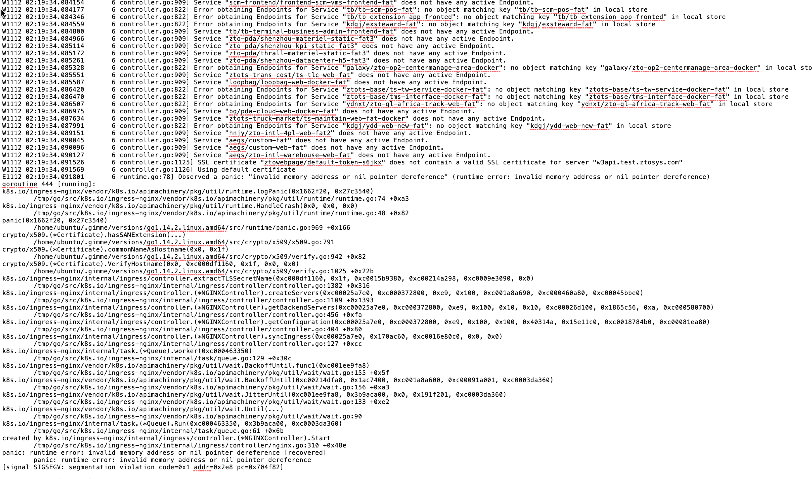
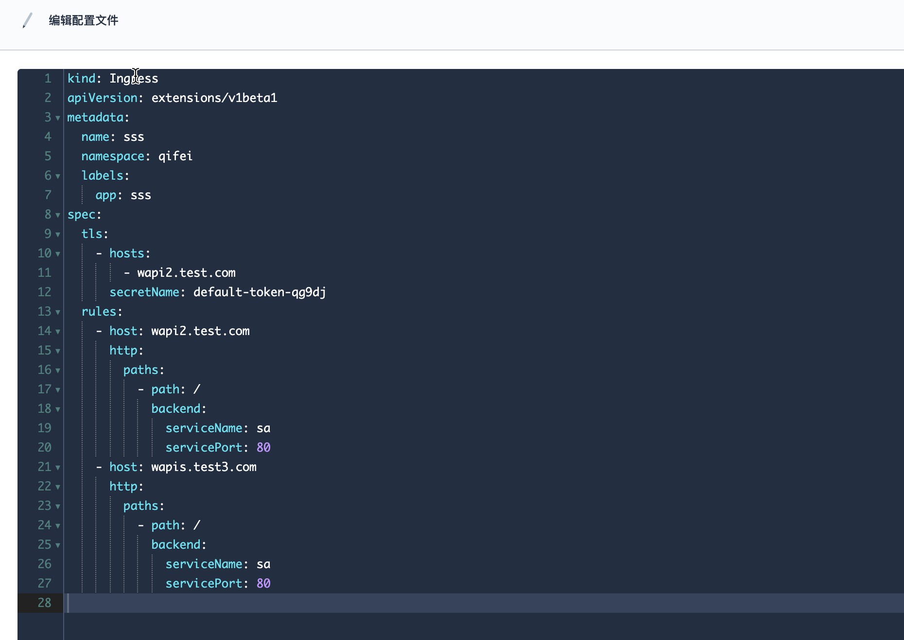
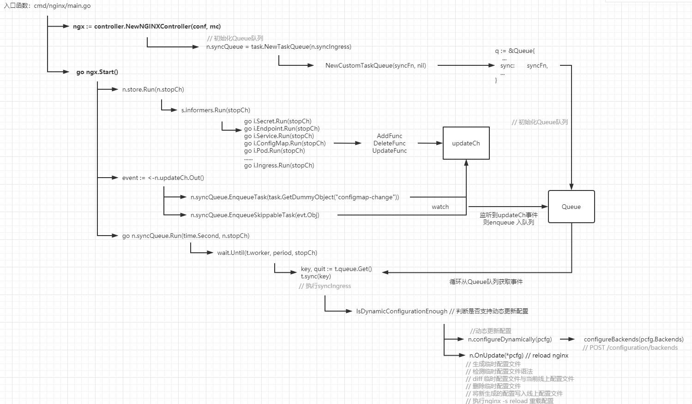

### Kubernetes故障篇：用户误操作竟导致集群ingress控制器挂了

### 1. 问题背景

某天早晨刚上班，突然群里有很多人反馈测试环境域名访问不了了，经过一顿操作发现测试集群的ingress-nginx-controller容器状态竟然变为`CrashLoopBackOff`而且还在反复重启，我们迅速查看ingress容器日志，发现如下报错信息：



通过日志初步定位本次问题是和域名的`ingress SSL`配置有关，为了尽快解决问题我们先把对应ingress资源备份了一下然后删掉，过了一分钟左右ingress-nginx-controller容器自动重启完就绪探针通过以后，业务系统的域名也逐渐都恢复了。

### 2. 分析故障原因

根据之前导出的ingress yaml配置，重新创建ingress资源以复现问题，yaml配置如下所示：



测试过程中发现本次故障发生条件为：

- ingress中启动https协议配置，通过secret配置的证书内容不合法，例如选择当前namespace下默认创建的service-account-token类型secret；
- 部分域名在spec.rules[\*].host字段配置，但是不包含在spec.tls[\*].hosts列表里面

本次出问题集群使用的ingress-nginx-controller镜像版本为0.32.0，我们尝试对 [ingress-nginx代码](https://github.com/kubernetes/ingress-nginx) 对应分支代码进行分析找到原因。

这里带大家先分析一下ingress-nginx项目启动流程，如下图所示：



#### 2.1 ingress nginx入口函数

主要包含：

- 解析命令行参数
- 初始化k8s client
- 初始化nginx controller
- 启动nginx controller

```go
// 路径：cmd/nginx/main.go
func main() {
	...
	// 解析命令行参数
	showVersion, conf, err := parseFlags()
	...
    // 创建k8s client
	kubeClient, err := createApiserverClient(conf.APIServerHost, conf.RootCAFile, conf.KubeConfigFile)
	...
	// 兼容不同版本ingress资源
	k8s.IsNetworkingIngressAvailable, k8s.IsIngressV1Ready = k8s.NetworkingIngressAvailable(kubeClient)

	conf.Client = kubeClient
	...
	
	// 实例化nginx controller
	ngx := controller.NewNGINXController(conf, mc)

	// 启动controller
	go ngx.Start()

	handleSigterm(ngx, func(code int) {
		os.Exit(code)
	})
}
```

#### 2.2 nginx controller实例化

主要包含：

- nginx controller初始化
- 实例化store(本地缓存)
- 创建同步队列：此处会对队列的sync属性进行赋值
- 监听本地配置文件

```
#代码路径 internal/ingress/controller/nginx.go
func NewNGINXController(config *Configuration, mc metric.Collector) *NGINXController {
	eventBroadcaster := record.NewBroadcaster()
	eventBroadcaster.StartLogging(klog.Infof)
	eventBroadcaster.StartRecordingToSink(&v1core.EventSinkImpl{
		Interface: config.Client.CoreV1().Events(config.Namespace),
	})

	...
	// 实例化nginx controller
	n := &NGINXController{
		isIPV6Enabled: ing_net.IsIPv6Enabled(),
		resolver:        h,
		cfg:             config,
		syncRateLimiter: flowcontrol.NewTokenBucketRateLimiter(config.SyncRateLimit, 1),

		recorder: eventBroadcaster.NewRecorder(scheme.Scheme, apiv1.EventSource{
			Component: "nginx-ingress-controller",
		}),
		stopCh:   make(chan struct{}),
		updateCh: channels.NewRingChannel(1024),
		ngxErrCh: make(chan error),
		stopLock: &sync.Mutex{},
		runningConfig: new(ingress.Configuration),
		Proxy: &TCPProxy{},
		metricCollector: mc,
		command: NewNginxCommand(),
	}
	...
	//实例化store，实现了Informer机制和thread safe stores的封装
	n.store = store.New(
		config.Namespace,
		config.ConfigMapName,
		config.TCPConfigMapName,
		config.UDPConfigMapName,
		config.DefaultSSLCertificate,
		config.ResyncPeriod,
		config.Client,
		n.updateCh,
		pod,
		config.DisableCatchAll)

	// 初始化syncQueue，传入syncIngress函数对队列的sync属性进行赋值
	n.syncQueue = task.NewTaskQueue(n.syncIngress)


	onTemplateChange := func() {
		template, err := ngx_template.NewTemplate(nginx.TemplatePath)
		...
			return
		}
		n.t = template
		n.syncQueue.EnqueueTask(task.GetDummyObject("template-change"))
	}

	ngxTpl, err := ngx_template.NewTemplate(nginx.TemplatePath)
	n.t = ngxTpl
	// watch nginx模板文件更新
	_, err = watch.NewFileWatcher(nginx.TemplatePath, onTemplateChange)

	return n
}
```

##### 2.2.1 实例化store(本地缓存)

controller需要监听ingress、service、configmap、endpoint、secret、pod等资源的增、删、改动作。

store是对informer和k8s thread safe store的封装，New函数包含：

- store对象实例化
- 各资源informer初始化
- 各资源Lister初始化
- 添加各资源Add、Update、Delete事件回调方法

```go
// 代码路径：internal/ingress/controller/store/store.go
func New(
	namespace, configmap, tcp, udp, defaultSSLCertificate string,
	resyncPeriod time.Duration,
	client clientset.Interface,
	updateCh *channels.RingChannel,
	pod *k8s.PodInfo,
	disableCatchAll bool) Storer {

	// 实例化k8sStore对象
	store := &k8sStore{
		informers:             &Informer{},
		listers:               &Lister{},
		sslStore:              NewSSLCertTracker(),
		updateCh:              updateCh,
		backendConfig:         ngx_config.NewDefault(),
		syncSecretMu:          &sync.Mutex{},
		backendConfigMu:       &sync.RWMutex{},
		secretIngressMap:      NewObjectRefMap(),
		defaultSSLCertificate: defaultSSLCertificate,
		pod:                   pod,
	}
	...
	
	// 实例化informer factory，并且实例化ingress、secret、configmap、service、pods等资源的informer
	infFactory := informers.NewSharedInformerFactoryWithOptions(client, resyncPeriod,
		informers.WithNamespace(namespace),
		informers.WithTweakListOptions(func(*metav1.ListOptions) {}))
	
	store.listers.Ingress.Store = store.informers.Ingress.GetStore()

	store.informers.Endpoint = infFactory.Core().V1().Endpoints().Informer()
	store.listers.Endpoint.Store = store.informers.Endpoint.GetStore()

	store.informers.Secret = infFactory.Core().V1().Secrets().Informer()
	store.listers.Secret.Store = store.informers.Secret.GetStore()

	store.informers.ConfigMap = infFactory.Core().V1().ConfigMaps().Informer()
	store.listers.ConfigMap.Store = store.informers.ConfigMap.GetStore()

	store.informers.Service = infFactory.Core().V1().Services().Informer()
	store.listers.Service.Store = store.informers.Service.GetStore()

	labelSelector := labels.SelectorFromSet(store.pod.Labels)
	store.informers.Pod = cache.NewSharedIndexInformer(
		&cache.ListWatch{
			ListFunc: func(options metav1.ListOptions) (k8sruntime.Object, error) {
				options.LabelSelector = labelSelector.String()
				return client.CoreV1().Pods(store.pod.Namespace).List(context.TODO(), options)
			},
			WatchFunc: func(options metav1.ListOptions) (watch.Interface, error) {
				options.LabelSelector = labelSelector.String()
				return client.CoreV1().Pods(store.pod.Namespace).Watch(context.TODO(), options)
			},
		},
		&corev1.Pod{},
		resyncPeriod,
		cache.Indexers{},
	)
	store.listers.Pod.Store = store.informers.Pod.GetStore()

	// ingDeleteHandler用于处理ingress Delete事件
	ingDeleteHandler := func(obj interface{}) {
		ing, ok := toIngress(obj)
		...
		store.listers.IngressWithAnnotation.Delete(ing)
		key := k8s.MetaNamespaceKey(ing)
		store.secretIngressMap.Delete(key)
		updateCh.In() <- Event{
			Type: DeleteEvent,
			Obj:  obj,
		}
	}
	// ingEventHandler用于初始化ingress资源的事件回调方法
	ingEventHandler := cache.ResourceEventHandlerFuncs{
		AddFunc: func(obj interface{}) {
			ing, _ := toIngress(obj)
			...
			// 
			store.syncIngress(ing)
			store.updateSecretIngressMap(ing)
			store.syncSecrets(ing)

			updateCh.In() <- Event{
				Type: CreateEvent,
				Obj:  obj,
			}
		},
		DeleteFunc: ingDeleteHandler,
		UpdateFunc: func(old, cur interface{}) {
			oldIng, _ := toIngress(old)
			curIng, _ := toIngress(cur)
			...
			store.syncIngress(curIng)
			store.updateSecretIngressMap(curIng)
			store.syncSecrets(curIng)
			updateCh.In() <- Event{
				Type: UpdateEvent,
				Obj:  cur,
			}
		},
	}
	// 以下为初始化处理endpoint、secret、configmap、service、pods等资源的事件回调方法
	...
	// 通过informer.AddEventHandler函数为各资源添加事件回调方法
	store.informers.Ingress.AddEventHandler(ingEventHandler)
	store.informers.Endpoint.AddEventHandler(epEventHandler)
	store.informers.Secret.AddEventHandler(secrEventHandler)
	store.informers.ConfigMap.AddEventHandler(cmEventHandler)
	store.informers.Service.AddEventHandler(serviceHandler)
	store.informers.Pod.AddEventHandler(podEventHandler)
	...
	return store
}
```

#### 2.3 nginx Controller启动

主要步骤：

- store启动

  主要逻辑为通过goroutine启动所有资源的informer

- nginx controller多副本主从选举

- nginx服务启动

- 同步队列启动

  主要逻辑为根据传入的间隔定期执行worker函数，从队列中取出事件执行sync函数

- for循环

  通过select实现nginx服务异常退出自动拉起和消费updateCh通道中的事件

```go
#代码路径 internal/ingress/controller/nginx.go
func (n *NGINXController) Start() {
	// 启动store里面注册的Informer进行资源监听
	n.store.Run(n.stopCh)
	...
	// 多个ingress副本之间进行主从选举
	setupLeaderElection(&leaderElectionConfig{
		Client:     n.cfg.Client,
		ElectionID: electionID,
		OnStartedLeading: func(stopCh chan struct{}) {
			if n.syncStatus != nil {
				go n.syncStatus.Run(stopCh)
			}
			...
		},
		OnStoppedLeading: func() {
			n.metricCollector.OnStoppedLeading(electionID)
		},
		PodName:      n.podInfo.Name,
		PodNamespace: n.podInfo.Namespace,
	})
	...

	// 启动nginx服务
	n.start(cmd)

    // n.syncQueue.Run函数用于定期从n.syncQueue队列里面消费数据
	go n.syncQueue.Run(time.Second, n.stopCh)
	n.syncQueue.EnqueueTask(task.GetDummyObject("initial-sync"))

	for {
		select {
        //接收程序异常，当n.isShuttingDown不为true情况下尝试重新拉起nginx服务
		case err := <-n.ngxErrCh:
			if n.isShuttingDown {
				return
			}
			if process.IsRespawnIfRequired(err) {
				process.WaitUntilPortIsAvailable(n.cfg.ListenPorts.HTTP)
				cmd.Process.Release()
				cmd = n.command.ExecCommand()
				cmd.SysProcAttr = &syscall.SysProcAttr{
					Setpgid: true,
					Pgid:    0,
				}
				n.start(cmd)
			}
		// 接收各informer产生的事件并进行处理
		case event := <-n.updateCh.Out():
			if n.isShuttingDown {
				break
			}

			if evt, ok := event.(store.Event); ok {
				...
				// 接收事件并插入n.syncQueue队列
				n.syncQueue.EnqueueSkippableTask(evt.Obj)
			} else {
				klog.Warningf("Unexpected event type received %T", event)
			}
		case <-n.stopCh:
			return
		}
	}
}
```

到这一步nginx controller启动过程已经完成，后续运行过程中主要业务流程就是informer持续监听k8s apiserver，当有资源变动会通过updateCh.In()方法把事件放入updateCh通道中。主程序for循环中的case会一直监听updateCh.Out()方法，当有事件产生会自动插入syncQueue队列，实现了一套updateCh通道的生产者-消费者模型。而syncQueue实现了第二套生产者-消费者模型，syncQueue(同步队列)启动的时候会定期执行worker方法去消费syncQueue中的数据，当有数据产生时会执行sync（实际为syncIngress）方法List ingress资源并更新nginx配置。

#### 2.4  syncIngress分析

###### 重点来了！！！

本次故障发生的原因就存在于syncIngress函数逻辑中，为了尽快定位到原因对ingress资源与nginx配置解析的部分我们就不详细讲了，直接根据调用逻辑找到发生问题的地方。代码如下：

```go
// 代码路径: internal/ingress/controller/controller.go
func (n *NGINXController) syncIngress(interface{}) error {
	...
    // List所有ingress资源
	ings := n.store.ListIngresses(nil)
	hosts, servers, pcfg := n.getConfiguration(ings)
	...
}

// getConfiguration函数返回所有ingress对应的Configuration结构
func (n *NGINXController) getConfiguration(ingresses []*ingress.Ingress) (sets.String, []*ingress.Server, *ingress.Configuration) {
	upstreams, servers := n.getBackendServers(ingresses)
	...
}

// getBackendServers函数返回ingress后端的使用的upstream和server列表
func (n *NGINXController) getBackendServers(ingresses []*ingress.Ingress) ([]*ingress.Backend, []*ingress.Server) {
	du := n.getDefaultUpstream()
	upstreams := n.createUpstreams(ingresses, du)
	servers := n.createServers(ingresses, upstreams, du)
	...
}

// createServer函数会根据upstream结构体构造一个域名为key，server结构体为value的map
func (n *NGINXController) createServers(data []*ingress.Ingress,
	upstreams map[string]*ingress.Backend,
	du *ingress.Backend) map[string]*ingress.Server {

	servers := make(map[string]*ingress.Server, len(data))
	allAliases := make(map[string][]string, len(data))

	// 初始化nginx server和root location配置
    ...

	// 配置默认的location，alias，SSL
	for _, ing := range data {
		ingKey := k8s.MetaNamespaceKey(ing)
		anns := ing.ParsedAnnotations

		for _, rule := range ing.Spec.Rules {
			host := rule.Host
			...
            if len(ing.Spec.TLS) == 0 {
				continue
			}
			// 验证secret包含的证书是否包含对应域名
			tlsSecretName := extractTLSSecretName(host, ing, n.store.GetLocalSSLCert)
			...
		}
	}
	...
}

func extractTLSSecretName(host string, ing *ingress.Ingress,
	getLocalSSLCert func(string) (*ingress.SSLCert, error)) string {

	// 当rule中的host和tls中host匹配，直接返回secret name
	lowercaseHost := toLowerCaseASCII(host)
	for _, tls := range ing.Spec.TLS {
		for _, tlsHost := range tls.Hosts {
			if toLowerCaseASCII(tlsHost) == lowercaseHost {
				return tls.SecretName
			}
		}
	}

	// 当rule中的host和tls中host不匹配，尝试去匹配整数中SAN或者CN
	for _, tls := range ing.Spec.TLS {
		secrKey := fmt.Sprintf("%v/%v", ing.Namespace, tls.SecretName)
		cert, err := getLocalSSLCert(secrKey)
		err = cert.Certificate.VerifyHostname(host)
		return tls.SecretName
	}

	return ""
}
```

syncIngress 经过的函数调用链如下：

```
n.syncIngress() ---> n.getConfiguration() ---> n.getBackendServers() ---> n.createServers() ---> extractTLSSecretName()
```

最终的问题点落在了extractTLSSecretName函数，我们根据代码逻辑分析一下本次故障的原因。

1. createServers 函数会遍历ing.Spec.Rules，当ing.Spec.TLS字段不为空时会把rule.Host、ingress以参数形式传入extractTLSSecretName函数；
2. extractTLSSecretName函数首先会遍历ing.Spec.TLS，校验tls.Hosts中是否包含host，如果包含直接返回tls.SecretName；
3. 当tls.Hosts中不包含host时，会把tls.SecretName对应的secret资源转为`*ingress.SSLCert`类型并且校验host是否匹配证书中的SAN或CN属性。然而当我们配置的secret为非TLS类型证书时，cert.Certificate值为nil，就会导致cert.Certificate.VerifyHostname(host)处代码会报panic导致主程序异常，然后nginx controller就挂了；

### 3. 问题解决方案

到这里我们已经通过分析代码，查出了本地nginx controller故障的原因。这种情况一般是因为用户配置不当导致的，但是Kubernetes在企业内部落地过程中，容器云平台很多使用者都对TLS证书、ingress不熟悉。但是因为用户配置不当导致集群入口流量网关挂掉的情况我们是不能接受的，所以我们还是要在平台层面避免这种情况出现。

我们的修复措施分两个方向：

1. 平台用户操作层面避免这种情况：主要是通过用户创建ingress选择证书时过滤掉非TLS类型的secret，保证绝大部分通过平台使用者不会触发此类问题；

2. 修复代码逻辑根治此问题：增加判断cert.Certificate是否为nil的逻辑，代码如下：

   ```go
   // 代码路径: internal/ingress/controller/controller.go
   func extractTLSSecretName(host string, ing *ingress.Ingress,
   	getLocalSSLCert func(string) (*ingress.SSLCert, error)) string {
   
   	lowercaseHost := toLowerCaseASCII(host)
   	for _, tls := range ing.Spec.TLS {
   		for _, tlsHost := range tls.Hosts {
   			if toLowerCaseASCII(tlsHost) == lowercaseHost {
   				return tls.SecretName
   			}
   		}
   	}
   
   	for _, tls := range ing.Spec.TLS {
   		secrKey := fmt.Sprintf("%v/%v", ing.Namespace, tls.SecretName)
   		cert, err := getLocalSSLCert(secrKey)
           
           // 
           if cert == nil || cert.Certificate == nil {
   			continue
   		}
           
   		err = cert.Certificate.VerifyHostname(host)
   		return tls.SecretName
   	}
   
   	return ""
   }
   ```

   针对这个问题我们也在github ingress-nginx项目提了issues，等待社区后续修复。

